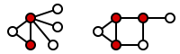
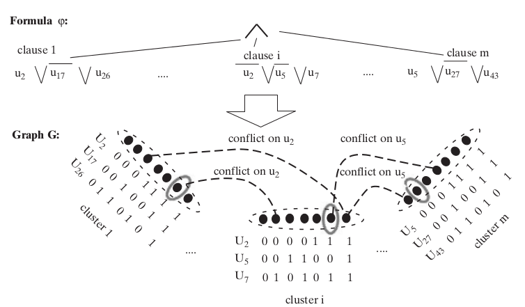
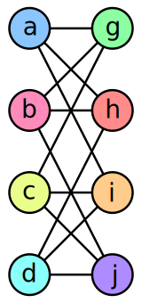
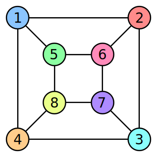
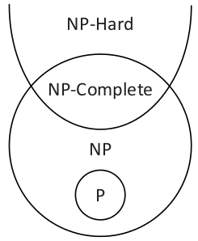

% Complejidad Computacional
   Unidad 2: Clases de complejidad

# Resumen Unidad 1

* tiempo de corrida de una máquina $M$ con input $x$
* lenguajes decidibles
* substituciones de máquinas con desaceleración
* existencia de máquinas universales
* lenguajes indecidibles

# Años 1960: complejidad computacional

* ¿cuales son las cosas que se pueden calcular *de manera eficaz*?
* de manera eficaz = con recursos limitados (tiempo, memoria,...)
* ¿Cual es la dificultad *intrinseca* de un problema?
* ¿Hay problemas computacionalmente más difíciles que otros?

# Como los vamos a resolver

* nos importa la relación entre el *tamaño de la entrada*
  y los recursos usados para llevar a cabo un cálculo
* queremos abstraernos del lenguaje de programación usado,
  y de otro detalles (tipo de máquina)
* sin embargo queremos medir o clasificar la complejidad de manera informativa

# Tiempo de corrida de una máquina

Una máquina computa $f$ o decide $L_f$ en tiempo $T(n)$
si su corrida en cada entrada $x$ necesita *cómo máximo* $T(|x|)$ pasos.

# Análisis asintótico

Para comparar funciones,
consideramos solamente el término más grande de una expresión,
ignorando el coeficiente de ese, y los términos más chiquitos.

La razón es que con entradas de tamaño grande, sólo el termino
más grande termina importando.

Ejemplo: $f(n)= 6n^2 + 2n^2 + 20n + 45$

El término de orden más grande es $6n^2$, y si nos abstraemos
del coeficiente $6$ podemos decir que $f$ vale
asipmtoticamente como máximo $n^3$.

Escribimos $f(n) = O(n^3)$.

# Notación O grande

Dadas las funciones $f,g : \mathbb{N} \mapsto \mathbb{N}$.
Escribimos $f(n) = O(g(n))$ si existen una constante
$c > 0$ y un rango $n_0 \in \mathbb{N}$ tales que para toda $n > n_0$,
$f(n) \leq c.g(n)$.

$f(n)= O(g(n))$ significa que $f$ es menor
o igual a $g$ si no consideramos las diferencias
hasta un factor constante.

# Notación o chiquita

Dadas las funciones $f,g : \mathbb{N} \mapsto \mathbb{N}$.
Escribimos $f(n) = o(g(n))$ si:

$lim_{n \rightarrow +\infty} (f(n)/g(n))=0$

es decir, para cualquier $c > 0$, existe $n_0$
tal que para toda $n>n_0$, $f(n) < c.g(n)$ .

# Ejemplos o chiquita

* $n^{1/2} = o(n)$
* $n = o(n log(log n))$
* $n log( log (n) ) = o (n log n)$
* $n log n = o(n^2)$
* $n^2 = o(n^3)$
* nunca ocurre que $f(n) = o(f(n))$

# O vs o

La O grande dice que una función *no es más grande* asimptóticamente
que otra ($\leq$).

La o chiquita dice que una función es *menor* asimptóticamente que otra
($<$).

# Linear speed-up theorem (Hartmanis y Stearns, 1965)

Si $f$ es computable por una máquina $M$ en tiempo $T(n)$, entonces
para cualquiera constante $c \geq 1$, $f$ es computable por una máquina $M'$ en
tiempo $T(n)/c$.

Idea: $M'$ tiene un alfabeto y conjunto de estados más grande que $M$.

# Clases de complejidad **TIME**

Sea $T: \mathbb{N} \mapsto \mathbb{N}$. Un lenguaje $L$ es en
**TIME**(T(n)) si existe una máquina que corre en tiempo $c⋅T(n)$
(para un $c > 0$) y decide $L$.

# **SPACE**

Sea $s:\mathbb{N}\mapsto{N}$ y $L\subseteq \{0,1\}^*$.

Decimos que
$L\in$**SPACE**$(s(n))$ si existe una máquina M y una constante $c$
tal que M decide $L$ y además, para todo input de longitud $n$,
$M$ visita cómo máximo $c.s(n)$ casillas en sus cintas
(excluyendo la cinta de input)
durante la computación.

Observación: como $M$ decide $L$, $M$ se detiene después de un número
finito de pasos.

# **TIME** y **SPACE**

En cada paso, una máquina puede descubrir cómo máximo
un número constante de casillas nuevas, entonces para
cualquier $f$:

**TIME**$(f(n)) \subseteq$ **SPACE**$(f(n))$

# Configuraciones

Una *configuración* de una máquina es el contenido de todas las casillas
no blancas de sus cintas, las posiciones de sus cabezales y su estado activo.

Si una máquina corre en espacio $O(s(n))$, entonces
necesitamos $O(s(n))$ casillas para representar 
una de sus configuraciones.

# Grafo de configuraciones

Sea M una máquina, $x\in\{0,1\}^*$.

El *grafo de configuraciones* de M, llamado $G_{M,x}$, es un grafo
dirigido cuyos nodos corresponden a todas las configuraciones
de M cuando el input es $x$.

$G_{M,x}$ tiene un eje de la configuración $C$ a la configuración
$C'$ si $C'$ es alcanzable a partir de $C$ en un paso según la
función de transición de M.

---

Sea M una máquina corriendo en espacio $s(n)$. El número de configuraciones
$C_M(n)$ de $M$ con input $n$ es acotado por:

$C_M(n) \leq |Q_M| \cdot n \cdot s(n) \cdot |\Sigma_M|^{s(n)}$

con $|Q_M|$ los estados de $M$, $|\Sigma_M|$ su alfabeto.

En particular si $s(n) \geq log(n)$ tenemos $C_M(n) = 2^{O(s(n))}$.

---

Consecuencia: una máquina decidiendo un lenguaje en espacio $s(n)$ no
corre en más que $2^{0(s(n))}$, sino entraría en un bucle infinito.

Esto nos da:

**TIME**$(s(n))$ $\subseteq$ **SPACE**(s(n))  $\subseteq$ **TIME**$(2^{O(s(n))})$

# Clases en tiempo y en espacio

**P** = $\bigcup_{c \geq 1}$ **TIME**$(n^c)$

**EXPTIME** = $\bigcup_{c \geq 0}$**TIME**$(2^{n^c})$.

**PSPACE** = $\bigcup_{c>0}$ **SPACE**$(n^c)$

**L** = **SPACE**$(log(n))$

Inclusiones según el resultado anterior: dibujar díagramo de Venn.

# **P** como clase de problemas fáciles

La clase **P** es robusta si cambiamos el tipo de máquina que usamos (ver
resultados Unidad 1).

Doblar el tamaño del input sólo necesita $k$ veces más tiempo (con $k$ constante):

* inputs de longitud $n$ necesitan tiempo $n^c$
* inputs de longitud $2n$ necesitan $(2n)^c = (2^c)n^c$

# Con **P** (y arriba), no importa (tanto) el modelo

Cuando vamos a describir algoritmos para **P**, no vamos a describir
máquinas hasta los últimos detalles.

Cuando tenemos un algoritmo en pseudocódigo
cuya complejidad podemos caracterizar, podemos decir que
tenemos una máquina que implementa ese mismo algoritmo, con
una deceleración polinomial.

# Codificación

* Tenemos que medir el tamaño de los datos manejados por las
  máquinas (y/o nuestros algorítmos) en *bits*.
* Tiene un impacto como representamos los símbolos,
  números, grafos, conjuntos, mátrices, etc.
* En particular, escribir un número en base binaria es exponencialmente
  más sucinto que en base unaria. Puede ser que un algorítmo para
  $L_{unario}$ corra en tiempo polinomial pero su equivalente para $L_{binario}$
  en tiempo exponencial!
* Buena noticia, operaciones usuales (eg $+$, $-$, $.$, $/$)
  se pueden hacer en tiempo polinomial con representación binaria

# Críticas de "**P** = problemas fáciles"

* es demasiado permisiva
* es demasiado estricta

# Lenguajes en **P**

* PATH
* RELPRIME
* LOOKUP

(Arora and Barak, 1.8)

* PATH = $\{\lfloor (G,s,t) \rfloor \mid$ G un grafo dirigido con camino $s \rightarrow t\}$
    * algoritmo brute-force ($m^m$ caminos posibles) → PATH $\in$ **2EXPTIME**
    * algoritmo goal-oriented → PATH $\in$ **P**   (Sipser, thm. 7.14)
---

* RELPRIME = $\{\lfloor (x,y) \rfloor \mid$ $x,y\in\mathbb{N}$ relativamente primos $\}$
    * enumerar todos los dividores de $x$ y $y$, si otro que $1$
      aparece en ambas listas, output $0$, sino $1$ 
      → RELPRIME $\in$ **EXPTIME** si $\lfloor (x,y) \rfloor$ en binario!
    * algoritmo de Euclides: $\in$ **P**  (Sipser, thm. 7.15)

Algoritmo de Euclides:

    E: input: x,y
       hasta que y == 0:
           a) x ← x mod y
           b) intercambiar x y
       output x
    
    R: input: x,y
       si E(x,y) == 1 output accept
       si no, output reject       

---

* 2COLOR = $\{\lfloor G \rfloor \mid$ $G$ es coloreable por $2$ colores $\}$
    * $\in$ **P**
* 3COLOR = $\{\lfloor G \rfloor \mid$ $G$ es coloreable por $3$ colores $\}$
    * $\in$ **P**? no se sabe
    * $\in$ **EXPTIME** por cierto
    * $\in$ **TIME**($O(1.3289^n)$) (Beigel y Eppstein, 2000)

---

* VERTEXCOVER = $\{ \lfloor (G,k) \rfloor \mid$ se puede "cubrir" el grafo $G$ con $k$ nodos $\}$
* $\in$ **EXPTIME**
* $\in$ **P**? no se sabe

<!-- http://en.wikipedia.org/wiki/File:Minimum-vertex-cover.svg -->

---

LIN(0,1) = sistemas de inecuaciónes lineales con solución booleanas

(0-1 integer programming)

* sea $E=$:
    * $x_1 + 2x_2 + x_3 + x_4 \geq 3$ 
      $x_1 + x_4 \geq 0$ 
      $2x_1 + x_2 - x_3 \leq 1$
    * solución: $(1,1,0,0)$
    * E $\in$ LIN(0,1)

LIN(0,1) $\in$ **EXPTIME** (enumerar soluciones y verificar).

no se sabe si $\in$ **P**

---

* formulas de lógica proposicional: 
  $\varphi ~ :: x_i \mid \neg \varphi \mid \varphi_1 \wedge \varphi_2 \mid \varphi_1 \vee \varphi_2$
* sea $x_1, \ldots, x_n$ la variables que aparecen en $\varphi$, 
  escribimos $\varphi(z)$ el valor de $\varphi$ cuando sus variables son asignadas a $z \in \{0,1\}^n$
* si existe tal $z$, $\varphi$ es *satisfacible*
* SAT = $\{\lfloor \varphi \rfloor \mid$ $\varphi$ satisfacible $\}$
* $\in$ **EXPTIME**, no se sabe si $\in$ **P**
> si $\lfloor x \rfloor \in$ SAT, 3COLOR, ..., $x$ es un problema que tiene una *solución*,
> que es *pequeña* y *verificable rapidamente*

No es el caso de todos los lenguajes en **EXPTIME**.

# Clases de complejidad: inclusiones estrictas

Capitulo 9 de Sipser.

Vamos a ver resultados que implican inclusiones estrictas
entre clases de complejidad:

* time hierarchy theorem
* space hierarchy theorem

Implican que con más recursos, se pueden resolver más
problemas.

# Definición preliminaria

$f: \mathbb{N} \mapsto \mathbb{N}$ es *constructible en espacio*
si la función que mapea la string $1^n$ a la representación binaria de
$f(n)$ es computable en espacio $O(f(n))$.

$f: \mathbb{N} \mapsto \mathbb{N}$ es *constructible en tiempo*
si $f(n) = O(n . log n)$ y si la función que mapea la string $1^n$
a la representación binaria de
$f(n)$ es computable en tiempo $O(f(n))$.

# Problemas arbitrariamente difíciles

Para toda función $T: \mathbb{N} \mapsto \mathbb{N}$ constructible en tiempo,
existe un lenguaje $L_T$ decidible que *no* puede ser decidido por una máquina
corriendo en tiempo $T(n)$. 

# Demostración

$L_T = \{ \lfloor M \rfloor \mid M$ es una MT y $M(\lfloor M \rfloor) =1$
en $T(|\lfloor M \rfloor|)$ pasos $\}$

* $L_T$ es decidible (usar MT universal)
* $L_T$ *no* se puede decidir en menos de $T(n)$ pasos
    * supongamos $\exists$ N que decide $L_T$ en $\leq T(n)$ pasos.
    * entonces $\exists$ N' (definida gracias a N) tal que:
        * si input $\in L_T$, corre siempre
        * si input $\notin L_T$, se detiene y imprime $1$ (en $\leq T(n)$ pasos)
        * ¿Qué pasa con $N'(\lfloor N' \rfloor)$?

# Time Hierarchy Theorem (Hartmanis y Stearns, 1965)

Generalización del resultado previo:

Si f,g son funciones constructibles en tiempo tales que $f(n).log(f(n)) = o(g(n))$, entonces

**TIME**$(f(n))$ $\subset \neq$ **TIME**$(g(n))$

En particular: **TIME**($n^c$) $\subset \neq$ **TIME**($n^d$) con $c < d$.

# Aplicación

Consecuencia del time hierarchy theorem:

**P** $\subset$ **EXPTIME**

# **P** vs **EXPTIME**

* **P** = $\bigcup_{c \geq 1}$ **TIME**$(n^c)$
* **EXPTIME** = $\bigcup_{c \geq 1}$**TIME**$(2^{n^c})$.
* time hierarchy theorem → **P** $\subset$ **EXPTIME**

# Space Hierarchy Theorem

Para $f$ constructible en tiempo, existe un lenguaje $L$
decidible en espacio $O(f(n))$ pero no en espacio $o(f(n))$

Corolario:

Para $f,g$ constructibles en tiempo con $f(n) = o(g(n))$:

**SPACE**($f(n)$) $\subset$ $\neq$ **SPACE**($g(n)$)

# Reducciones

Sipser capítulo 7.

Reducción de un lenguaje a otros.

* sin acotar en recurso la reducción: provee resultados de decidibilidad
* acotando la reducción en tiempo polinomial
* acotando la reducción en espacio log

Para que una reducción sea interesante en términos de complejidad
computacional, tiene que ser barata con respeto al lenguaje de
destino.

Vamos a usar las reducciones Karp en tiempo polinomial.

# Reducciones

Sea $A, B\subseteq\{0,1\}^*$. A es *reducible en tiempo polinomial* a
$B$, denotado $A \leq_{p} B$,
si existe una función $f:\{0,1\}^* \mapsto \{0,1\}^*$
computable en tiempo polinomial
tal que para todo $x\in\{0,1\}^*$, $x \in A$ ssi $f(x)\in B$.

 

Proposiciones:

* si $A \leq_p B$ y $B \in$ **P** entonces $A \in$ **P**
* $\leq_p$ es transitiva

# Ejercicio

* Mostrar que 3COLOR $\leq_p$ SAT:
* Proveer una traducción G → $\varphi_G$
* Demostrar que: G tiene un coloreo → $\varphi_G$ tiene una asignación
* Demostrar que: $\varphi_G$ tiene una asignación → G tiene un coloreo

# Hardness y Completeness

Esas nociones indican cuando un problema representa la
dificultad de la clase a cual pertenece.

# **NP**

Un lenguaje $L \subseteq \{0,1\}^*$ está en **NP** ssi existe un polinomio
$p: \mathbb{N} \mapsto \mathbb{N}$ y una MT M corriendo en tiempo polinomial
tal que para todo $x \in \{0,1\}^*$:

$~ ~ ~ x \in L \leftrightarrow \exists u \in \{0,1\}^{p(|x|)} ~$ tal que $~ M(x,u)=1$

> * M se llama la *verificadora* de $L$, y $u$ un *certificado* de $x$ (con respeto a $L$ y M).
> * La definición de **NP** es asimétrica!

# Lenguajes en **NP**

existencia de certificados cortos = pertenencia a **NP**:

* SAT, LIN(0,1), 3COLOR 
* traveling salesman
* subset sum
* graph isomorphism
* numeros compuestos
* ...

# **P** $\subseteq$ **NP** $\subseteq$ **EXPTIME**

* **P** $\subseteq$ **NP**
* **NP** $\subseteq$ **EXPTIME**

 

> * No se sabe si **P** ≠ **NP**, ni si **NP** ≠ **EXPTIME**.

# **P** y **NP**

* en **P** están los problemas fáciles
* en **NP** están los problemas que tienen soluciones facilmente chequeables
* **NP** representa los problemas de búsqueda con soluciones cortas

# máquinas nondeterministas

> * Una MTND tiene $\delta_0$ and $\delta_1$ y un estado especial $q_{accept}$.
> * En cada paso, una MTND hace una elección arbitraria entre las dos funciones de transición.
> * Para un input $x$,  si existe **una** secuencia de
>   esos pasos (elecciones nondeterminísticas) que hace que
>   M alcanza $q_{accept}$, decimos que $M(x) = 1$.
> * Si *toda* secuencia de elecciones hace que M
>   se detiene sin alcanzar $q_{accept}$, decimos que $M(x)=0$.
> * M *corre en tiempo $T(n)$* si para todo input
>   $x\in\{0,1\}^*$ y toda secuencia de elecciones nondeterminísticas,
>   M alcanza $q_{halt}$ o $q_{accept}$ dentro de $T(|x|)$ pasos.

# Observación

Una MTND *no* representa cálculos fisicamente realisables.

# Definición tradicional de **NP**

Sea $T: \mathbb{N} \mapsto \mathbb{N}$ y $L\subseteq \{0,1\}^*$.
Decimos que $L \in$ **NTIME**$(T(n))$ si existe una constante $c>0$ y una TMND
M en tiempo $c⋅T(n)$ tal que para todo $x\in \{0,1\}^*$:
$$x\in L \leftrightarrow M(x)=1$$

$NP_{old} = \bigcup_{c\in \mathbb{N}}$**NTIME**$(n^c)$

 

# Equivalencia

Las dos definiciones son equivalentes.

1. $L \in NP_{old}$ → $L \in NP$
    * si existe una MTND M que decide $L$, se puede construir
      una MTD $M'$ que, con input $(x,u)$ y $u$ de longitud adecuada,
      simula una computación de $M$ con input $x$ eligiendo $\delta_{u[n]}$
      en cada paso $n$.
2. $L \in NP$ → $L \in NP_{old}$
    * se puede construir una MTND que, con input $x$, genera un certificado
      en $p(|x|)$ pasos de manera nondeterministica, y luego lo averigua
      con la verificadora de $L$.

# **NP** hardness, completeness

Decimos que B es **NP** difícil (hard) si para todo $A\in$ **NP**, $A \leq_p B$.
Decimos que $B$ es **NP** completo (complete) si $B$ es
**NP** difícil y está en **NP**.

 

Proposiciones:

* si L es **NP** difícil y L $\in$ **P**, entonces **P** = **NP**
* si L es **NP** completo, entonces L $\in$ **P** ssi **P** = **NP**.

# Un lenguaje **NP** completo

TMSAT = $\{ \lfloor M, x, 1^n, 1^t \rfloor \mid \exists u\in\{0,1\}^n . M(x,u)=1$ en t pasos$\}$

>* TMSAT $\in$ **NP**: la verificadora de N es una máquina universal de Turing que simula
>  M con input (x,u) y verifica que su output es 1 despues de $t$ pasos. Su corrida es
>  polinomial en función de su input porque se puede simular máquinas con una desaceleración polinomial.
>* Sea L $\in$ **NP**. Existe verificadora M corriendo en tiempo polinomial $q(n)$, y existe
>  un polinomio $p(n)$ que determine el tamaño de los certificados. Entonces a toda $x\in L$
>  le asociamos la string $\lfloor M, x, 1^{p(n)}, 1^{q(n+p(n))}\rfloor$
>  con n = |x|

# **CNF-SAT**

* un literal es una variable o una variable negada ($x_i$, $\neg x_i$)
* una cláusula es una disyuncción de literales tal que no aparece un literal y su contrario
* ej: $x_1 \vee \neg x_2 \vee \neg x_3$
* una formula proposicional es en Forma Normal Conjunctiva si
  es una conjuncción de cláusulas
* ej: $(x_1 \vee x_3) \wedge (x_1 \vee \neg x_2 \vee \neg x_3 \vee x_4) \wedge (\neg x_1 \vee \neg x_4)$
* definimos **CNF-SAT** = $\{ \lfloor \varphi \rfloor \mid \varphi$ es en FNC y es satisfacible $\}$

**SAT** $\leq_p$ **CNF-SAT**

* Idea: introducir variables nuevas para evitar explosión exponencial

# **3SAT**

* una formula es en 3FNC si es en FNC y cada cláusula tiene como máximo 3 literales
* ej: $(x_1 \vee x_3) \wedge (\neg x_2 \vee \neg x_3 \vee x_4) \wedge (\neg x_1 \vee \neg x_4)$
* **3SAT** = $\{ \lfloor \varphi \rfloor \mid \varphi$ es en 3FNC y es satisfacible $\}$

**CNF-SAT** $\leq_p$ **3SAT**

* Idea: introducir variables nuevas para evitar explosión exponencial

# Teorema de Cook-Levin

* Cook "The Complexity of Theorem Proving Procedures", 1971
* Levin "Универсальные задачи перебора", 1973

SAT es NP-complete

# Poder expresivo booleano

* Igualdad:
  la formula
  $$(x_1 \vee \neg y_1) \wedge (\neg x_1 \vee y_1)
  \wedge  \ldots \wedge (x_n \vee \neg y_n) \wedge (\neg x_n \vee y_n)$$
  es satisfacible por una asignación $z$ ssi $x_i(z) = y_i(z)$ para todo $i$.
* Funciónes booleanas:
  dada $f: \{0,1\}^k \mapsto \{0,1\}$:
    * para $v \in \{0,1\}^k$, definimos $C_v(x_i,..,x_k)$ una cláusula  tal que
      $C_v(v)=0$ y $C_v(u)=1$ para $u\neq v$
  <!--  * ej: $v = (1,1,0,1)$ → $\neg x_1 \vee \neg x_2 \vee x_3 \vee \neg x_4$-->
    * definimos
      $\varphi = \bigwedge_{\{v \mid f(v)=0\}} C_v(x_1,x_2,\ldots,x_k)$
    * entonces:
        * $\forall z \in \{0,1\}^k, \varphi(z) = f(z)$ 
        * $|\varphi| \leq k2^k$

---

Sea $L \in$ **NP**, queremos mostrar que $L \leq_{p} SAT$.

Por definición, $\exists$ M corriendo en tiempo polinomial y $p$ polinomio tal que para todo $x \in \{0,1\}^*$:
$$x \in L \leftrightarrow  \exists u \in \{0,1\}^{p(|x|)} . M(x,u)=1$$

Queremos una transformación en tiempo polinomial $x \mapsto \varphi_x$ tq:
$$\exists u \in \{0,1\}^{p(|x|)} . M(x,u)=1 \leftrightarrow \varphi_x \in SAT$$

---

Reemplazamos la verificadora M por una version que:

1. tiene 2 cintas (con input en lectura sola)
2. es indiferente:
    * las corridas de M toman el mismo tiempo para todo input de
      tamaño $n$
    * la ubicación de los cabezales de M en un paso $i$ sólo dependen
      del tamaño del input y de $i$

---

Un *instantáneo* de M es un tuple $(a,b,q) \in \Gamma^2 \times Q$.

Un instantáneo puede ser representado con $c$ bits, $c$ dependiendo de $\Gamma$ y $Q$
(y independiente del input).

Una *traza* es una succesión de instantáneos.

> * ¿Cuales son las condiciones que debe cumplir una traza para representar
>   una corrida exitosa de M con input $(x,u)$?
> * Vamos a construir $\varphi_x$ como un patrón de traza que es satisfacible
>   si y sólo si existe un $u$ tal que $M(x,u) =1$

---

A partir de la función de transición de M definimos:

* $\delta_{write}: \Gamma^2 \times Q \mapsto \Gamma$
  <!-- obs: delta_write(z1) deberia devolver blank, no lo hace pero se arregla -->
* $\delta_{state}: \Gamma^2 \times Q \mapsto Q$

Como M es indiferente, se pueden definir las funciones $\mathbb{N}\mapsto\mathbb{N}$:

* $inpos(i)$ la  posición del cabezal de input en el paso $i$.
* $prev(i)$ el último paso antes de $i$ tal que
  el cabezal de escritura está en el mismo lugar que en el paso $i$.
  Definimos $prev(i)=1$ por defecto.

Los valores de $inpos(i)$ and $prev(i)$ no dependen del input $y = (x,u)$.
Además esos valores pueden ser calculados en tiempo polinomial, corriendo M con un input trivial.

---

Restricciones que debe cumplir una traza $[z_1,z_2,...,z_{T(n)}]$
para representar una corrida exitosa de M con input $y$:

* $z_1= (\triangleright, \triangleright, q_{start})$
* $z_{T(n)} = ( a , 1 , q_{halt})$, $a \in \Gamma$
* para todo $z_i =(a_i,b_i,q_i)$ con $i\in \{2, \ldots , T(n) \}$:
    * $a_i = y_{inpos(i)}$
    * $b_i = \delta_{write}(z_{prev(i)})$
    * $q_i = \delta_{state}(z_{i-1})$
* para cada $i\in\{2, \ldots, T(n)\}$, existe une función $f$ tal que
  esas restricciones son cumplidas ssi
  $f(y_{inpos(i)},z_{prev(i)}, z_{i-1},z_i) = 1$

Queremos:
$\varphi_x \in SAT \leftrightarrow \exists u \in \{0,1\}^{p(|x|)} . y = (x,u) . M(y)=1$

---

Variables de $\varphi_x$:

* $Y_i$ con $i \in [1.. n + p(n)]$
* $Z_i$ con $i \in [1 .. cT(n)]$

Codificación de las restricciónes:

* $y[1..n] = x$ → formula de tamaño $2n$
* $z_1$ → formula de tamaño $2c$
* $z_{T(n)}$ → formula de tamaño $\leq 2c$

---

* para cada $i\in[2..T(n)]$,
  $$f(y_{inpos(i)},z_{prev(i)}, z_{i-1},z_i) = 1$$
  → formula $\varphi_i$ de tamaño $(3c + 1)2^{3c+1}$ tal que
  $$\varphi_i( Y', Z'_1, Z'_2, Z'_3  ) = 1 \leftrightarrow f(...) = 1$$,
  con:
    * $Y'$ son las variables que codifican $y_{inpos(i)}$
    * $Z'_1$ son las variables que codifican $z_{prev(i)}$
    * $Z'_2$ → $z_{i-1}$
    * $Z'_3$ → $z_i$
    * para cada $i$, para conocer $Y'$, $Z'_1$, $Z'_2$, $Z'_3$, hay que conocer $inpos(i)$
      y $prev(i)$, y para eso hay que correr y observar $M(0^{n + p(n)})$

---

Tamaño de $\varphi_x$:

$2n + 2c + 2c + (T(n)-1)(3c+1)2^{3c+1}$
$\leq$  $d(n + T(n))$, $d \in \mathbb{N}$

* se puede construir $x \mapsto \varphi_x$ en tiempo polinomial:
    1. correr $M(0^{n + p(n)})$
    2. generar $\varphi_x$
* $\varphi_x$ es en FNC

---

* supongamos $x \in L$ 
  → $\exists u\in\{0,1\}^n . M(x,u) =1$ 
  → existe una traza que reprensenta la corrida exitosa de $M(x,u)$ 
  → usando $u$ y la traza, se puede construir una asignacion $z$ tal que $\varphi_x(z)=1$ 
  → $\varphi_x \in$ CNF-SAT
* supongamos $\varphi_x \in$ CNF-SAT 
  → existe $z$, $\varphi_x(z) =1$ 
  → constuir $u$ a partir de $z$ 
  → x$\in L$ 

---

* L $\leq_p$ CNF-SAT
* Entonces CNF-SAT es **NP**-difícil
* Entonces es **NP**-completo

# Teorema de Cook-Levin

Dados L $\in$ **NP** y una string $x$,
construimos $\varphi_x$ tal que $x\in L$ ssi
$\varphi_x \in$ CNF-SAT.

Idea: Sea M una verificadora de L indiferente y con 2 cintas.

$\varphi_x$ es un "patrón de trazas" de las corridas
exitosas de M con input $x$ y $u$ ($u$ certificado de $x$).

---

* supongamos $x \in L$ 
  → $\exists u\in\{0,1\}^n . M(x,u) =1$ 
  → existe una traza que representa la corrida exitosa de $M(x,u)$ 
  → usando $u$ y la traza, se puede construir una asignacion $z$ tal que $\varphi_x(z)=1$ 
  → $\varphi_x \in$ CNF-SAT
* supongamos $\varphi_x \in$ CNF-SAT 
  → existe $z$, $\varphi_x(z) =1$ 
  → constuir $u$ a partir de $z$ 
  → x$\in L$ 

---

* L $\leq_p$ CNF-SAT, para cualquier L $\in$ **NP**
* Entonces CNF-SAT es **NP**-difícil
* Entonces CNF-SAT es **NP**-completo

# **3SAT**

* una formula es en 3FNC si es en FNC y cada cláusula tiene como máximo 3 literales
* **3SAT** = $\{ \lfloor \varphi \rfloor \mid \varphi$ es en 3FNC y es satisfacible $\}$

**CNF-SAT** $\leq_p$ **3SAT**

Idea: usar regla de la resolución al revés.

# Uso de la **NP** completitud de 3SAT

* Se sospecha que **P** ≠ **NP**, o por lo menos que estar **NP** difícil es una garantia de
  dificultad aceptada hoy en día
* Teniendo un lenguaje, es más fácil mostrar una reducción desde 3SAT que
  desde cualquier lenguaje **NP**
* La forma de formulas en FNC-3 es conveniente.

# INDSET es **NP** completo

INDSET =
  $\{\lfloor (G,k) \rfloor \mid\exists S\subseteq N(G),|S|\geq k,\forall uv\in S, uv\not\in E(G)\}$

INDSET $\in$ **NP** porque el certificado es el conjunto $S$.

Mostramos 3SAT $\leq_p$ INDSET.

---

Sea $\varphi = \bigwedge C_i$ una formula en FNC3.
Sea $m$ el número de cláusulas de $\varphi$, construimos un grafo $G$ tal que
$\lfloor \varphi \rfloor \in 3SAT \leftrightarrow \lfloor (G,m) \rfloor \in INDSET$.

Cada cláusula $C$ de $\varphi$ tiene ≤ 3 literales, entonces
hay ≤ 7 asignaciones que la satisfacen.

Construimos para $C$ un cluster de 7 nodos, marquamos cada uno con
las asignaciones que satisfacen su cluster.

Conectamos dos puntos si pertenecen a clusters distintos y representan asignaciones
inconsistentes (ie, 1 variables es asignada a 1 en un nodo y 0
en el otro).

Conectamos entre si todos los puntos de un mismo cluster.

---

---

> * La transformación se puede hacer en tiempo polinomial.
> * $\varphi$ satisfacible → existe asignación $z$ tal que $\varphi(z)=1$ 
>   → definir $S$ los nodos de cada cluster que corresponden a la restriccion de $z$
    a las variables del cluster  → hay $m$ nodos no conectados entre si en $G$
> * hay $m$ nodos no conectados entre si en $G$ 
>   → pertenecen a clusters distintos 
>   → las asignaciones parciales que esos nodos representan son consistentes 
>   → con ellas construimos $z$ tal que $\varphi(z)=1$ 
>   → $\varphi$ satisfacible

# VERTEXCOVER es **NP** completo

Reducción descrita en Sipser, teorema 7.44.

# Búsqueda vs decisión

Supongamos **P** = **NP**. Para todo lenguaje L $\in$ **NP** y una verificadora
M para L, existe una MT B corriendo en tiempo polinomial que construye un certificado
para todo input $x \in L$.

---

Demostración:

* en el caso de SAT: si **NP**=**P**, construir una asignación para $\varphi$ se hace en tiempo polinomial:
    1. probar si $\varphi\in$ SAT, seguir si es el caso
    1. probar si $\varphi(x_1 ← 0) \in$ SAT, en ese caso fijar el primer bit de $z$
       a $0$ y reemplazar $x_1$ por 0 en $\varphi$, en el caso contrario hacer lo mismo con $1$
    1. seguir hasta tener una asignación completa para $\varphi$
* en el caso general, con L $\in$ **NP**, usar el hecho que la reducción que vimos es una reducción
  *Levin*, ie, se puede construir un certificado para $x\in L$ a partir del certificado de $\varphi_x$
  en tiempo polinomial.

# **P** vs **NP** y **NP** completitud

> * 1956: Kurt Gödel escribe una carta a John von Neumann planteándole
>   la posibilidad de decidir en tiempo polinomial si una formula
>   de primer order tiene una prueba de longitud $n$
> * 1971: Cook "The Complexity of Theorem Proving Procedures"
> * 1972: Karp "Reducibility Among Combinatorial Problems"
> * 1972: Miller and Thatcher, editors.
>   "Complexity of computer computations". Plenum Press:
>   proceedings de la conferencia donde se presentó el artículo de Karp
>   frente a 200 investigadores en computación (según el deseo de
>   Michael Rabin)
> * 1971/3: Levin "Универсальные задачи перебора" (*Universal search problems*)

# Como manejar problemas **NP**-completos

> * Heuristicas: NP es acerca de todos los inputs posibles, mientras que en casos
>   concretos los inputs pueden tener rasgos explotables
>   (simplicidad, simetrías, variables interconectadas, etc.)
> * Fijar parametros (parametrized complexity)
> * Canjear exactitud por velocidad

# **EXP** vs **NEXP**

**NEXP** = $\bigcup_{c \geq 0}$**NTIME**$(2^{n^c})$.

Ejercicio: encontrar la definición equivalente con certificados.

Teorema:

**EXP** ≠ **NEXP** implica **P** ≠ **NP**

---

Supongamos **P**=**NP**.
Sea L$\in$**NTIME**$(2^{n^c})$, y M una MT para $L$.

Sea $L_{pad}=\{ x 0 1^{2^{|x|}^c}  \mid x \in L \}$.
Mostramos que $L_{pad}\in$ **NP**:

* existe una MTND para $L_{pad}$: dado $y$, chequea si es de la forma
  $y = z 01^{2^{|z|}^c$. Si no, output 0.
* Correr $M$ con input $z$ por $2^{|z|}^c$ pasos.
* El tiempo de corrida es polinomial en función de $|y|$.

Entonces si **P**=**NP**, $L_{pad}\in$**P** y existe $M'$ deterministica
que decide $L_{pad}$.

Entonces $L\in$**EXP**: para decidir si $x \in$**L**, lo padeamos
con $01^{2^{|x|^c}}$ y vemos si esto pertenece a $L_{pad}$ usando $M'$.

# El problema de la factorización

Existen problemas naturales
que se sospecha estar en **NP** $\setminus$ **P** sin ser **NP** completos.

Factorización:

> Dado $n, m\in\mathbb{N}$ tal que $1 \leq m \leq n$, ¿ $n$ tiene un factor $d$
> tal que $1 < d < m$?

Se sospecha que FACTOR no está en **P**, ni es **NP** completo ni **coNP** completo.

Observación: el problema ¿ $n\in\mathbb{N}$ es un número compuesto? es una versión
relajada de FACTOR y está en **P** (equivalentemente, PRIMES está en **P**).

---

Otros problemas en **NP**, sospechados de estar en
**NP** $\setminus$ (**P** $\cup$ **NPC**)

>* isomorfirmo de grafos 
>    
>* problema de la autopista con peaje (*turnpike problem*):
>  dadas $n(n-1)/2$ distancias entre pares de puntos,
>  ¿les corresponde alguna configuración de $n$ puntos en una línea?

# Teorema de Ladner

Si **P**≠**NP**, existe un lenguaje en **NP** $\setminus$ **P** que no es **NP** completo.

Idea: definir un problema tal que para ciertos inputs de tamaño $n$,
el problema es resolver SAT (para que no este en **P**), y en otros
inputs no hacer nada (para que no sea **NP** completo).

[Prueba detallada adaptada de Arora y Barak](ladner.html)

# Jerarquia polinomial

Ver diapositivas de Nabil Mustafa.

Si **P**=**NP**, todo es la misma clase.

# Conclusiones

No tenemos ninguna demostración que **P** ≠ **NP** (≠ **EXPTIME**) pero hoy en día
se supone que **NP** es más dificil que **P** (y más fácil que **EXPTIME**).

# Lectura

1. Arora y Barak: Capítulo 1.6 hasta el final (P).
2. Sipser: Capítulo 7 (P, NP)
3. Arora y Barak 3.1, Sipser 9 (space/time hierarchy theorem)
4. Aaronson: [prueba del teorema de Cook-Levin sin usar MT indiferente (sección 5)](https://stellar.mit.edu/S/course/6/sp12/6.045/courseMaterial/topics/topic1/lectureNotes/lec9/lec9.pdf)

# Referencias

* Hartmanis y Stearns, "On the computational complexity of algorithms", 1965
* Lipton "The P=NP Question and Gödel’s Lost Letter" (Cap. 1)
* [Unos problemas entre **P** y **NP** completitud](http://cstheory.stackexchange.com/questions/79/problems-between-p-and-npc/237#237)

