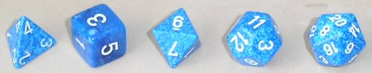

% Complejidad Computacional
   Unidad 4: Aleatoriedad

# Fuentes

* Sipser 10.2
* Arora y Barak cap. 7

# Computación y recursos

> * tiempo
> * espacio
> * **¿correctitud?**

# Punto de esta unidad

Hay problemas interesantes que se caracterizan por tener algoritmos eficientes
que dependen de una fuente interna de aleatoriedad, y que se equivocan con
una probabilidad arbitrariamente baja.

Un algoritmo aleatorio tiene acceso a una fuente de bits aleatorios.
Luego este algoritmo puede usar esos bits para guiar su computo.

# Secuencia aleatoria de bits

00101110010011100001011101111101....

Tenemos una idea intuitiva de lo que hace que una secuencia de bits
es aleatoria. 

* la cantidad de 0 y de 1 tiende a ser igual en el infinito
  (elimina 111111111101111111111110111111...)
* no tiene patrón. Dicho de otra forma, es *incomprimible*,
  para cada tramo inicial de la secuencia, no existe programa más
  chiquito que lo genere (elimina 010101010101010101....)

Recién al fin del siglo 20 se definió matemáticamente que significaba "ser aleatoria".

Ver: Church, Martin-Löf, Kolmogorov, Chaitin.

En esta clase no necesitamos conocer esas definiciones. Suponemos que
esas secuencias se pueden generar.

# Fuentes de aleatoriedad

#

#

#

#

Hardware que usa ruido del ambiente (temperatura, radiaciones, etc.) para generar bits aleatorios.

<https://www.kickstarter.com/projects/moonbaseotago/onerng-an-open-source-entropy-generator>

#

# Generadores pseudoaleatorios

Son algoritmos que generan secuencias que parecen aleatorias.

# ¿Cuál es el punto?

Sacrificar *un poco* de correctitud para ahorrar *mucho* tiempo.

Un algoritmo rapido con probabilidad de error muy baja
puede ser más deseable que un algoritmo lento totalmente exacto.

En el mundo real, los cálculos tienen una probabilidad
de no terminar, por más que en teoría sean determinísticos
y terminan:

* una computadora puede fallar por sus componientes internos
* un cálculo puede fallar por causas externas (se corta la luz...)

# Máquina de Turing Probabilista

Una MTP es una MT con dos funciones de transición $\delta_0$ y $\delta_1$.
Para ejecutar una MTP $M$ con un input $x$, se elige en casa paso con
probabilidad $1/2$ entre aplicar $\delta_0$ y $\delta_1$.

La máquina sale $1$ (aceptar) o $0$ (rechazar). Denotamos $M(x)$
la variable aleatoria correspondiente al valor que $M$ escribe
al final de su cálculo. Dada una función $T:\mathbb{N}\mapsto\mathbb{N}$,
decimos que $M$ corre en tiempo $T(n)$ si para todo input $x$,
$M$ se detiene con input $x$ en $T(\left|x\right|)$ pasos independientemente
de sus elecciones aleatorias.

$Pr[M(x)=1]$ es la fracción de ramas de computación de $M$ que
se terminan con output $1$.

# Diferencias MTP vs MTND

La diferencia con MTND es la interpretación del grafo de las
computaciones posibles. Una MTND acepta $x$ si existe $1$ rama
exitosa.

Una MTP representa una computación realista.

# Ejemplo: Igualdad de polinomios

Tenemos dos polinomios de grado $d$, descritos de manera compacta,
queremos chequear si son iguales o no:

$$(1 - x)^5 (5x^4 +7x)^3 - (x - 5)^64 = (x-4)^8(x^2+5x)^{425} ?$$

Desarrollar los términos demora un tiempo exponencial en función
del tamaño inicial de los polinomios.

Pero eligir un $x$ aleatorio, y metiéndolo en los polinomios
para comparar sus valores en $x$ es mucho más rápido.

Si los dos polinomios son distintos, en cuantas valores pueden
estar iguales? En $d$ valores, según el teorema fundamental del algébra.
Y hay poca chance que un real aleatorio les haga coincidir.

# Reducción de la probabilidad de error

Sea una máquina $M_1$ probabilista corriendo en tiempo $T(n)$.
Puede dar una respuesta equivocada con probabilidad $0 < e < 1/2$.

¿Como reducir esa probabilidad de error?

# Lema de amplificación (Sipser 10.5)

Sea $0 < e < 1/2$ una constante, $p(n)$ un polinomio
$p(n)$, y $M_1$ una máquina probabilista corriendo en
tiempo polinomial con probabilidad de error $e$.

Entonces existe una máquina probabilista $M_2$ corriendo
en tiempo polinomial equivalente, que tiene probabilidad
de error de $2^{-p(n)}$.

#

Idea: M2 corre M1 una cantidad polinomial de veces
y toma la mayoría de las salidas de M1.

Dada una entrada $x$, M2 hace lo siguiente:

1. calcular $k$
2. correr M1 $2k$ veces con entrada $x$
3. devolver accept o reject segun la mayoría de las
  respuestas de M1

#

Midamos la proba que M2 se equivoque.

Sea S la secuencia de resultados de las corridas de M1.
Sea $p_S$ la proba que M2 obtenga S.
Tenemos $2k = c + w$ con $c$ la cantidad de resultados
correctos y $w$ la cantidad de resultados equivocados de M1.

M2 se equivoca si $c \leq w$.
Sea $e_x$ la proba que M1 erre con entrada $x$.
Si $S$ es una secuencia "mala", entonces:

* $p_S \leq (e_x)^w (1 - e_x)^c$
* observar que $e_x (1 - e_x) \leq e (1 - e)$ (dado que $e_x \leq e < 1/2$)
* observar que $c \leq w$
* entonces $p_S \leq e^w (1 - e)^c$
* observar que  $k \leq w$ y $e < 1 - e$
* entonces $e^w(1-e)^c  = e^k e^{k-w} (1-e)^c$
* como $e^k e^{k-w} (1-e)^c \leq e^k (1-e)^{k-w} (1-e)^c$
* luego $p_S \leq e^k (1 - e)^k$

#

Hay $2^{2k}$ secuencias posibles, entonces $2^{2k}$
secuencias malas posibles como máximo. Entonces:

Pr[M2 se equivoca con entrada x]

= $\Sigma_{S ~ mala ~} ~ ~  p_S$

$\leq 2^{2k} e^k(1-e)^k$

$= (4e (1 - e))^k$

Como $e < 1/2$ entonces $4e (1 - e) < 1$, y la probabilidad
decrece exponencialmente en función de $k$.

Si buscamos a bajar la proba de error de M2 a $2^{-t}$
elijimos $k \geq t/\alpha$ con $\alpha = log_2(4e(1-e))$.

Conclusión: podemos bajar arbitrariamente la probabilidad de error,
manteniendo un tiempo de corrida polinomial.

# Clases de complejidad aleatorias

Ahora vemos más precisamente las clases de complejidad
con aleatoriedad y los resultados correspondientes.

Ver slides de Nabil Mustafa: **RP**, **coRP**, **BPP**, **ZPP**.

# Definición de clases probabilistas con máquinas deterministas

En lugar de suponer que las máquinas tienen dos funciones de transición y
una fuente interna de bits aleatorios, podemos decir que son deterministas
y toman con su entrada una secuencia de bits aleatorios.

Ejemplo: L $\in$ **RP** si existe una máquina determinista M corriendo en tiempo
polinomial y un polinomio $p(n)$ tal que:

* $x \in L \rightarrow$ $Pr_{r \in \{0,1\}^{p(|x|)}}$[M(x,r) = 1] $\geq 1/2$
* $x \notin L \rightarrow$ $Pr_{r \in \{0,1\}^{p(|x|)}}$[M(x,r) = 0] $=1$

Demostrar que **BPP** $\subseteq$ **PSPACE**.

# Relación entre **BPP** y clases deterministas

* **P** $\subseteq$ **BPP**: trivial
* **BPP** y **NP**: no se sabe
* **BPP** $\subseteq$ **PSPACE**: demostrable enumerando secuencias aleatorias posibles

# Una clase inútil: **PP**

Fue definida junta a las otras por John Gill en el 1977.

Otro nombre propuesto para **PP**: **Majority-P**.

L $\in$ **PP** si existe una MT probabilista tal que
para toda entrada $x$:

* si $x\in L$, Pr[M(x) = 1  ] $> 1/2$
* si $x \notin L$, Pr[M(x) = 0] $> 1/2$

¿Diferencia con **BPP**?

# **PP** vs **BPP** 

**BPP**: la probabilidad de contestar correctamente es una constante que no depende del input
(oficialmente $2/3$ pero puede ser cualquiera $> 1/2$).

**PP**: la probabilidad puede depender del tamaño del input: $1/2 + 2^{-n}$

Consecuencia: amplificación no funciona con **PP** (requiere cantidad exponencial de repeticiones)

Tenemos **BPP** $\subseteq$ **PP**.

Problema en **PP**: MAJSAT = formulas satisfechas por la mayoría de las asignaciones de sus variables.

# Problema de la factorización

Factorización: la operación de encontrar la decomposición en factores primos de un entero dado.
Si ordenamos esos factores, esa decomposición es *única*.

Convertir ese problema en problema de decisión: hacer una pregunta si/no acerca de la decomposición
en factores primos (ej:  ¿tiene un factor que termina en 7?): FACTOR

¿Tiene forma de estar en NP?

Diferencia entre FACTOR y SAT:

* una formula Booleana tiene 0, 1 o n asignaciones, ie, certificados de pertenencia a SAT
* un número tiene *exactamente una* decomposición en factores primos, ie, 1 certificado

El certificado de FACTOR es de tamaño polinomial y se puede chequear que realmente es la decomposición
de la entrada haciendo multiplicaciones (en tiempo polinomial).

Sugiere que FACTOR tiene una estructura particular que podemos explotar. Sugiere también que
no es **NP**-completo.

#

Consecuencias:

* FACTOR $\in$ **NP**: tiene certificado corto y chequeable en tiempo polinomial + chequear que condición trival se cumple
* FACTOR $\in$ **coNP**: tiene certificado corto y chequeable en tiempo polinomial + chequear que condición trivial no se cumple

FACTOR esta en **NP** $\cap$ **coNP**.

# PRIMES

PRIMES = $\{ <N> \mid$ N es primo $\}$

* está en **coNP**: la no-primalidad se chequea con el certificado = decomposición en factores primos
* en 1975 Pratt demostró que está en **NP**: primeros certificados cortos para PRIMES
* en 1977, Solovay, Strassen y Rabin mostraron que esta en **coRP**
* en 1992, Adleman y Huang mostraron que está en **ZPP**
* en 2002, Agrawal, Kayal y Saxena mostraron que está en **P**

# PRIMES $\in$ **coRP**

Queremos un algoritmo que corra en tiempo polinomial en el tamaño de la representación
de N, ie, tiempo poly(log N).

PRIMES = $\{ <N> \mid$ N es primo $\}$

Dado un entero N y A $\in$ [1;N-1], definamos $QR_N(A)$ como:

* 0 si gcd(A,N) $\neq 1$
* 1 si A es un residuo cuadratico módulo N. Ie, A = $B^2$ (mod N) con algún B tal que gcd(B,N) =1
* -1 sino

#

Usamos los resultados siguientes:

* para todo primo impar N y $A\in[1;N-1]$: $QR_N(A) = A^{(N-1)/2} (mod N).$
* para todos N y A impares, definir el *símbolo de Jacobi* (N/A) como $\Pi^k_{i=1} QR_{Pi}(A)$ con P1,...,Pk siendo los factores primos (con repeticiones) de N (ie, $N = \Pi^k_{i=1} Pi$).
  Entonces (N/A) es computable en tiempo O(log A . log N).
* para todo impar compuesto N, y entre todos los $A\in[1;N-1]$
  tales que gcd(N,A)=1, por lo menos la mitad des A satisface $(N/A) = A^{(N-1)/2} (mod N)$.

Entonces tenemos el algoritmo P para PRIMES. Dado N impar:

1. eligir al azar $1\leq A < N$
2. si gcd(N,A) > 1 o $(N/A) \neq A^{(N-1)/2} (mod N)$, rechazar.
3. sino aceptar

#

Si N$\in$ PRIMES, el algoritmo siempre acepta.

Si N$\notin$ PRIMES, rechaza con probabilidad $\leq 1/2$.

Otra fuente : [Descripción del algoritmo de Miller y Rabin desde "As I mentioned", Scott Aaronson](http://www.scottaaronson.com/democritus/lec7.html)

# **P** y **BPP**

Hubo varios casos particulares de problemas que se de-aleatorizaron:

* PRIMES (de noRP a ZPP a P)
* UPATH (de RL a L)

Ver [derandomization](http://ocw.mit.edu/courses/electrical-engineering-and-computer-science/6-045j-automata-computability-and-complexity-spring-2011/lecture-notes/MIT6_045JS11_lec11.pdf)

Todavía ZEROP resiste.

Hay una sospecha que **P** = **BPP**, es decir que se puede en general
de-aleatorizar cualquier problema.

exists
a
fundamen
tal
question
as
to
w
h
e
t
her
ev
ery
probabilistic
algorithm
can
b
e
r
e
p
lac
ed
b
y
a
deterministic
one,
or
der
andomize
d
.
In
terms
of
complexit
y
,
the
question
is
whether
P
=BPP
,
whic
h
i
s
almost
as
deep
a
question
as
P=NP
.
There
is
curren
tly
a
v
ery
strong
b
elief
that
derandomization
is
p
oss
ib
le
in
general,
b
ut
no
one
y
et
kno
ws
ho
w
to
pro
v
e
it.

# Conclusiones

* se considera que **BPP** es una buena clase para representar los problemas resolvables
  concretamentes (más que **P**)

# Fuentes

* John Gill, Computational Complexity of Probabilistic Turing Machines, SIAM Journal on Computing, 6:675-695, 1977.
* Vaughan Pratt. Every prime has a succinct certificate. SIAM Journal on Computing, vol.4, pp.214–220. 1975.
