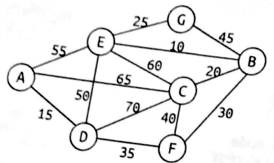

% Graphs

 1. Implement the graph building program of section 7.3,
    modifying it so that:
    * its output be in the same format as
      its input (then it is possible for the program to
      read again its output).
    * the structure `GVertex` do not have the fields `discover`,
      `finish` and `inDegree` (all the other ones are going to be
      useful).

 2. Modify the previous program by adding an implementation of the
    Bellman-Ford algorithm from section 7.9, and letting the user
    specify the source vertex.
    The implementation using at least one improvement of the
    algorithm described on
    [its Wikipedia page](https://en.wikipedia.org/wiki/Bellman%E2%80%93Ford_algorithm).

 3. Consider the following undirected graph:

    

    * Give the depth-first and breadth-first traversals starting at A
      (process edges in alphabetical order; give the intermediate states
      of the queue in the case of breadth-first)
    * Starting at C, derive the minimal-cost paths using Dijkstra's
      algorithm.
    * Derive and draw the minimum spanning tree obtained using Kruskai's
      algorithm.
        * Can you think of a simple optimization for Kruskai's
          algorithm?

 4. Read section 7.10.1 (Prim's Algorithm).
    * What is the difference
      between an iteration of Prim's algorithm and an iteration of
      Dijsktra's algorithm?
    * In the previous graph, starting at C,
      derive the minimal-cost paths using Prim's algorithm.

