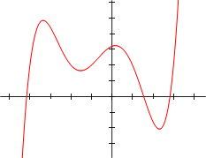

% Práctico Haskell 1: Tipos de Datos, Clases de Tipos

# Tipos Algebraicos de Datos

Definir los tipos y funciones siguientes en un archivo `tipos.hs`.

## 1. Tipos enumerados

Cuando los distintos valores que debemos distinguir en un tipo son
finitos, podemos enumerar todos los valores distintos para el tipo.
Por ejemplo, podrı́amos representar los tı́tulos nobiliarios
de algún paı́s (retrógrado) con el siguiente tipo:

~~~haskell
data Titulo = Ducado | Marquesado | Condado | Vizcondado | Baronia
~~~

a) Definí el tipo `Titulo` como descrito arriba. No tiene que pertenecer
   a la clase `Eq`.
b) Definí `hombre :: Titulo -> String` que devuelve la forma masculina
   del tı́tulo.
c) Definí la función `dama` que devuelve la inflexión femenina.

## 2. Constructores con parámetros

En este ejercicio, introducimos dos conceptos: los sinónimos de tipos
y tipos algebraicos cuyos constructores llevan parámetros.
Los sinónimos de tipos nos permiten definir nombres
de tipos nuevo a partir de tipos ya existentes:

~~~haskell
-- Territorio y Nombre son sinonimos de tipo.
type Territorio = String
type Nombre = String

cba , bsas :: Territorio
cba = "Cordoba"
bsas = "Buenos Aires"

alicia , bob :: Nombre
alicia = "Alicia"
bob = "Bob"
~~~

Los tipos algebraicos tienen constructores que llevan parámetros.
Esos parámetros nos permiten agregar información; por ejemplo, en este
ejercicio además de distinguir el rango de cada persona, representamos
datos pertinentes a cada tipo de persona:

~~~haskell
-- Persona es un tipo algebraico
data Persona = Rey                  -- constructor sin parametro
          | Noble Titulo Territorio -- constructor con dos parametros
          | Caballero Nombre        -- constructor con un parametro
          | Aldeano Nombre          -- constructor con un parametro
~~~

a) Definí los tipos `Territorio`, `Nombre` y `Persona` como descrito
   arriba. Este último tipo *no debe pertenecer a la clase `Eq`*.
b) Definí la función `tratamiento :: Persona -> String`
   que dada una persona devuelve la forma en que se lo menciona
   en la corte. Esto es, al rey se lo nombra "Su majestad el rey",
   a un noble se lo nombra "El <forma masculina del titulo> de <territorio>",
   a un caballero "Sir <nombre>" y a un aldeano simplemente con su nombre.
c) Agreguemos el tipo `data Genero = Hombre | Mujer` a nuestro módulo.
   ¿Cómo modificar el tipo `Persona` para poder
   representar personas de distintos géneros *sin agregarle más constructores*?
   Realizá esta modificación y vuelva a programar la función `tratamiento`
   de forma tal de respetar el género de la persona al nombrarla.
d) Definí la función `sirs :: [Persona] -> [String]`
   que dada un lista de personas devuelve solo los nombres de
   los hombres. Definila con dos casos: el caso base y el inductivo.
e) Definí una versión alternativa de esta última función, `sirs'`,
   con un solo caso, usando la función `filter`.

## 3. El tipo polimórfico `Maybe`

`Maybe` es un tipo predefinido en Haskell cuya definición es la
siguiente:

~~~haskell
data Maybe a = Nothing | Just a
~~~

El tipo `Maybe` sirve para "envolver" un tipo existente
(el tipo `a`) y darle un valor extra (`Nothing`)
que representa la ausencia de valor, o alguna falla.

El tipo `Maybe` es *polimórfico* porque en situaciones concretas,
puede tomar como parámetro otro tipo: `Maybe Int`, `Maybe String`,
etc.

Definí las funciones siguientes:

a) `division_segura :: Int -> Int -> Maybe Int`,
   que toma dos enteros y devuelve `Nothing` si el segundo es cero,
   o `Just c` donde `c` es el cociente del primero por el segundo.
b) `cabeza :: [a] -> Maybe a` que toma una lista
   y devuelve el primer elemento (dentro de `Just`) solamente si
   la lista no es vacía, y `Nothing` si es vacía.
c) `suma_maybe :: Maybe Int -> Maybe Int -> Maybe Int`
   que toma dos "enteros Maybe", y solo devuelve un `Just`
   de la suma si los dos son `Just`. En los otros casos,
   devuelve `Nothing`. 
d) `suma_maybe_num :: Num a => Maybe a -> Maybe a -> Maybe a`,
   una versión más general de `suma_maybe`.

## 4. Tipos recursivos y polimórficos

Consideremos la siguiente definición de tipo de datos:

~~~haskell
data ListAssoc a b = Empty
                   | Node a b (ListAssoc a b)
~~~

Este tipo es *recursivo* porque él mismo (`ListAssoc a b`) aparece
como un argumento de uno de sus constructores (`Node`).
Los parámetross del constructor de tipo (`ListAssoc`) indican que es un tipo polimórfico,
donde las variables `a` y `b` se pueden instanciar con distintos tipos;
por ejemplo:

~~~haskell
type Diccionario = ListAssoc String String
type DNI = Int
type Padron      = ListAssoc DNI    String
~~~

Definí las siguientes funciones:

 a) `la_comodin :: Int -> ListAssoc Int Int` que, dada un entero positivo `n`,
    construye un lista asociativa de `n` entradas desde `n` hasta `1`, cada
    entrada teniendo asociado el valor 0. Por ejemplo:

    ~~~haskell
    la_comodin 1 == Node 1 0 Empty
    la_comodin 3 == Node 3 0 (Node 2 0 (Node 1 0 Empty))
    la_comodin 0 == Empty
    ~~~

    Como `ListAssoc` no pertenece a la clase `Show`, no vas a poder comprobar esta
    función sola en GHCi, recién en conjunto con las funciones siguientes vas
    a poder ver si anda bien.
 b) `la_long :: ListAssoc a b -> Int` que
    devuelve la cantidad de datos en una lista.
 c) `la_pares :: ListAssoc a b -> [(a,b)]` que devuelve
    la lista de pares contenida en la lista de asociaciones.
 d) `la_existe :: Eq a => ListAssoc a b -> a -> Bool` que dada una lista y una
    clave devuelve `True` si la clave está y `False` en caso contrario.
 e) `la_buscar :: Eq a => ListAssoc a b -> a -> Maybe b` que dada una lista y
    una clave devuelve el dato asociado si es que existe.
    Podés consultar la definición del tipo `Maybe` en Hoogle.
 f) `la_agregar :: Eq a => a -> b -> ListAssoc a b -> ListAssoc a b` que dada
    una clave `a`, un dato `b` lo agrega en la lista si la clave a NO existe.
    En caso de que la clave `a` exista, se aplasta el dato anterior.
 g) `la_borrar :: Eq a => a ListAssoc a b -> ListAssoc a b` que dada una clave
    `a` elimina la entrada en la lista.

# Polinomios

## Preparación

Bajá el archivo pre-llenado: [Poly.hs](https://cs.famaf.unc.edu.ar/~hoffmann/rio18/Poly.hs).

## ¿Qué es un número?

Parece una pregunta profunda y filosófica, pero el sistema de tipos
de Haskell nos da una respuesta simple: un número es cualquier tipo
que tiene una instancia de la clase de tipos `Num`.
Veamos la definición de `Num`:

~~~haskell
class Num a where
    (+), (-), (*)  :: a -> a -> a
    negate         :: a -> a
    abs            :: a -> a
    signum         :: a -> a
    fromInteger    :: Integer -> a
~~~

Entonces, para Haskell, un número es simplemente algo que puede
ser sumado, restado, multiplicado, negado, etc. (La división no
es parte de la clase `Num` a propósito, dado que es definida
de manera distinta para los enteros y los flotantes.)
El Prelude de Haskell viene con varias instancias de `Num` que
ya conocemos. Incluyen los sospechosos de siempre: `Int`, `Integer`,
`Float` y `Double`. Pero la diversión no termina acá. Podemos
definir nuestros propios números, del momento que podemos proveer
definiciones sensatas para las operaciones numéricas básicas.

## ¿Un polinomio puede ser un número?

¡Cómo no! Los polinomios pueden
sumarse, restarse y multiplicarse como cualquier otro número. En
estos ejercicios, vamos a escribir una instancia de `Num` para un
tipo de polinomios que definimos nosotros.

Pensemos en como definir ese tipo. Un polinomio
es simplemente una secuencia de términos, y cada término tiene un
coeficiente y un grado. Por ejemplo, el polinomio $x^2 + 5x + 3$
tiene tres términos, uno de grado 2 con coeficiente 1, uno de grado
1 con coeficiente 5, y uno de grado 0 con coeficiente 3.

Vamos a evitar de especificar explicitamente los grados, y vamos a
representar un polinomio como una lista de coeficientes, cada uno
teniendo un grado igual a su posición en la lista. Vamos a permitir
que el tipo de los coeficientes sea polimórfico, así podemos tener
coeficientes que sean de tipo `Int`, `Double`, etc.

~~~haskell
data Poly a = P [a]
~~~

En esta representación, el polinomio $x^2 + 5x + 3$ se escribe
`P [3, 5, 1]`.

## Ejercicio 1

Observamos que nuestro tipo `Poly a` no deriva las clases `Eq` y `Show`.
¡Hay una excelente razón para eso! Las instancias por defecto de esas
clases de tipo no funcionarían tal como quisieramos.

En este ejercicio, vamos a escribir una instancia de la clase `Eq`
para el `Poly a`. Si hubieramos derivado esa instancia, Haskell
simplemente compararía las listas dentro del constructor `P`.
Pensemos en porqué esto no alcanza. ¿Cuándo es el caso que dos
`Poly` son equivalentes, pero sus representaciones en lista no lo son?

Implementá la función `(==)`. Acordate que no es necesario implementar
explicitamente la función `(/=)`; tiene una implementation por defecto
en términos de `(==)`. Ejemplos:

~~~haskell
P [1, 2, 3] == P [1, 2, 3]
P [1, 2] /= P [1, 2, 3]
~~~

Algunas funciones útiles pueden ser `takeWhile`, `dropWhile`,
`reverse` ...

## Ejercicio 2

La instancia por defecto de `Show` muestra simplemente valores tal
como están escritos en Haskell. Sería mucho mejor si un `Poly a`
como `P [1, 2, 3]` pudiera ser mostrado de manera más legible por
un humano, como `3x^2 + 2x + 1`.
 
Una instancia completa del tipo `Show` tendrá las características
siguientes:

* los términos son mostrados como `cx^e` donde `c` es el coeficiente y
  `e` es el exponente. Si `e` es 0, entonces se muestra solo el coeficiente.
  Si `e` es 1, entonces el formato es simplemente `cx`.
* los términos son separados por el símbolo `+` con un solo espacio de
  cada lado
* los términos son listados en orden decreciente de grado
* los términos que tienen coeficiente 0 no se muestran, salvo si
  el polinomio es igual a 0
* ningún coeficiente se muestra para un término cuyo coeficiente es 1,
  (o sea `x` en lugar de `1x`), salvo si su grado es 0
* ningún tratamiento especial es necesario para los términos con
  coeficiente negativo. Por ejemplo, `2x^2 + -3` es la representación
  correcta de $2x^2 - 3$.

Implementá la función `show` según esta especificación. Ejemplos:

~~~haskell
show (P [1, 0, 0, 2]) == "2x^3 + 1"
show (P [0, -1, 2]) == "2x^2 + -x"
~~~

Algunas funciones útiles pueden ser: `zip`, `reverse`,
`intercalate` (del módulo `Data.List`)...

## Ejercicio 3

Ahora vamos a definir la suma para el tipo `Poly a`.

La suma para polinomios es bastante simple, todo lo que tenemos que
hacer es sumar los pares de coeficientes para cada grado de los dos
polinomios. Por ejemplo, $(x^2 + 5) + (2x^2 + x + 1) = 3x^2 + x + 6$.

Se considera como buen estilo Haskell definir las funciones importantes
fuera de la instancia de clase de tipo. Por esa razón, vamos a escribir
la función `plus` que suma dos valores de tipo `Poly a`:

~~~haskell
plus :: Num a => Poly a -> Poly a -> Poly a
~~~

Observamos que el protótipo de `plus` indica la restricción que `a`
tiene una instancia `Num`. Esto significa que solo podemos sumar
polinomios que tienen coeficientes numéricos.

Como `a` tiene que ser un `Num`, podemos usar todas las funciones `Num`
usuales (i.e., `(+)`) sobre los coeficientes de los polinomios.
Ejemplos:

~~~haskell
P [5, 0, 1] + P [1, 1, 2] == P [6, 1, 3]
P [1, 0, 1] + P [1, 1] == P [2, 1, 1]
~~~

Definí la función `plus`.

## Ejercicio 4

En este ejercicio vamos a implementar la multiplicación de polinomios.
Para multiplicar dos polinomios, cada término del primer polinomio debe
ser multiplicado por cada término del segundo. La manera más simple de
lograr esto es de construir un `[Poly a]` donde cada elemento es el
polinomio que resulta de la multiplicación de un solo coeficiente en
el primer polinomio por cada coeficiente en el segundo.

Dado que los términos no dicen explicitamente sus exponentes, vamos a
tener que desplazar la salida antes de multiplicarla por cada coeficiente
consecutivo. Por ejemplo, `P [1, 1, 1] * P [2, 2]` va a producir la lista
`[P [2, 2], P [0, 2, 2], P [0, 0, 2, 2]]`.

Luego, podemos simplemente sumar esta lista. La función `sum` de Haskell
es definida en términos de `(+)`, pero también utiliza el literal numérico
`0`. Si queremos usar la función `sum` entonces tenemos que implementar la
función `fromInteger` en la instancia de `Num` para `Poly a` primero
(lo vamos a hacer en el próximo ejercicio de todos modos).

Sino, podemos también usar `foldr (+) (P [0])` en lugar de `sum` hasta
que implementemos `fromInteger`

Implementá la función:

~~~haskell
times :: Num a => Poly a -> Poly a -> Poly a
~~~

Ejemplo:

~~~haskell
P [1, 1, 1] * P [2, 2] == P [2, 4, 4, 2]
~~~

## Ejercicio 5

Ya llegó la hora de completar nuestra definición de la instancia
`Num` para los polinomios. Las funciones `(+)` y `(*)` ya fueron
completadas en los ejercicios anteriores. Solo necesitamos implementar
dos funciones más.

La primera función que vamos a implementar es `negate`.
Esta función debe devolver la negación de un `Poly a`.
En otros términos, el resultado de negar todos sus términos.

~~~haskell
negate :: Num a => Poly a -> Poly a
~~~

Ejemplo:

~~~haskell
negate (P [1, 2, 3]) == P [-1, -2, -3]
~~~

Definí `negate`.

De paso, la clase de tipo `Num` tiene una implementación
por defecto de `(-)` en términos de `(+)` y `negate`, entonces no tenemos
que implementarla.

Luego, implementá `fromInteger`. Esta función debe tomar un `Integer` y
devolver un `Poly a`. Un entero (o cualquier número estándar) se puede
ver como un polinomio de grado 0. Acordémonos que tenemos que convertir
ese `Integer` a un valor de tipo `a` antes de poder usarlo como coeficiente
en un polinomio.

~~~haskell
fromInteger :: Num a => Integer -> Poly a
~~~

La clase de tipo `Num` tiene dos funciones más que no tienen realmente
sentido para los polinomios (capaz que los polinomios no son números,
después de todo…).
Esas funciones son `abs`y `signum`. Las vamos a dejar como
`undefined` dado que el valor absoluto de un polinomio no es un polinomio,
y los polinomios no tienen realmente un signo.

## Ejercicio 6

Ahora queremos poder escribir expresiones como
`3x^2 + x^2 + 8`, y que sea
interpretado como polinomio por Haskell, directamente.

Primero necesitamos hacer un truco para que `x`
sea interpretado como esperamos. Considerá el
protótipo siguiente:

~~~haskell
x :: Num a => Poly
~~~

Agregá la definición correspondiente para que `x` sea el polinomio $x$.

A esta altura, con todo lo que hiciste, el polinomio $x^2 + 5x + 3$ se puede escribir
`x^2 + 5*x + 3` porque los valores `x`, `5` y `3` son todos valores
válidos del tipo `Poly Int`, y definiste `(+)` y `(*)` como parte de
la instancia `Num` para polinomios.

Podés ver que ahora se puede usar `(^)` para la exponenciación, por más que
no lo hayas implementado. En Haskell, `(^)` es definido en términos de `(*)`,
por lo cual viene "gratis".

Para terminar, definí la función `applyP` que aplica un `Poly a` a un valor de tipo `a`:

~~~haskell
applyP (x^2 + 2*x + 1) 1 == 4
applyP (x^2 + 2*x + 1) 2 == 9
~~~

