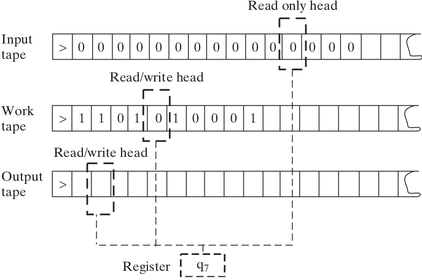

% Clase 1: Intro. Máquinas de Turing.

# Acerca de esta (mitad de) materia

## Objetivos

* saber lo que es una máquina  de Turing
* saber lo que es un lenguaje decidible, indecidible
* entender la importancia de las máquinas de Turing para las ciencias de la computación
* conocer la diferencia entre los lenguajes en P y los en NP
* saber lo que es un autómata, y un lenguaje reconocible por un autómata
* saber lo que es un autómata nodeterminista, y como convertirlo a uno determinista

## Evaluación

* el parcial 2 de Matemática Discretas III es sobre computabilidad y complejidad
* el parcial 3 se toma en 2 partes, la parte del prof. Hoffmann sobre autómatas


## Recursos, libros y apuntes

  * primera parte:
    * ['Computabilidad, Complejidad y Verificación de Programas', Rosenfeld e Irazábal, 2013](https://openlibra.com/es/book/download/computabilidad-complejidad-computacional-y-verificacion-de-programas)
  * segunda parte:
    * ['Introducción a la teoría de autómatas, lenguajes y computación', Hopcroft, Motwani y Ullman, 2007](https://www.frlp.utn.edu.ar/materias/sintaxis/automatas-lenguajes-computacion.pdf)

# Máquinas de Turing 

## Apunte

  * ['Computabilidad, Complejidad y Verificación de Programas', Rosenfeld e Irazábal, 2013](https://openlibra.com/es/book/download/computabilidad-complejidad-computacional-y-verificacion-de-programas)
    * Clase 1. Máquinas de Turing
    * ejercicios interesantes: 3, 4, 5, 7, 15

## Nacimiento de la idea

  * formalismo inventado por Alan Turing, publicado en 1937
  * abstraccion de una persona llevando a cabo un cálculo
    usando una hoja de papel
  * la hoja puede ser representada por cinta en 1 dimensión sin pérdida de generalidad
  * un cálculo dado requiere una cantidad finita de estados internos para
    representar sus etapas
  * Turing introduce la "computing machine" cómo abstracción de esto

## Definición

Una máquina de Turing tiene:

* un conjunto finito de estados internos
* $k$ cintas infinitas
  (si $k \geq 2$, la primera tiene el input en lectura sola)
* un cabezal por cinta, indica qué celda estamos leyendo,
  se puede mover de un paso en cada direccion
* una funcion de transición que describe su comportamiento
  (también llamada tabla de transición o reglas)

## Ilustración



## Reglas de una máquina de Turing

Cada regla tiene como entrada:

* El estado actual de la máquina
* El/los símbolo(s) leído(s)

Y como salida:

* El/los símbolos(s) para escribir
* El/los movimiento(s) de los cabezal(es)
* El estado nuevo de la máquina

## Ejercicios

En estos ejercicios trabajamos con Máquinas de Turing con 1 cinta, 2 símbolos (1 y 0),
que siempre empiezan su ejecución con la cinta puesta a cero, infinita en las dos direcciones.
O sea, máquinas sin input.

La idea es describir la ejecución de cada máquina
usando la notación "descripción instantánea".

## Descripción instantánea

* empezar por configuración inicial de la máquina y
  escribir las sucesivas configuraciones línea por línea
* escribir estado activo a la derecha de la posición del cabezal
* escribir el contenido de la cinta salvo los infinitos
  0 a la izquierda y a la derecha
* excepción: cuando toda la cinta está en cero
  (como al principio), escribir un cero 
* si se ejecuta la regla `FIN`, escribir `FIN`

## Ejemplo descripción instantánea

~~~
  | 0 | 1 |
a |1>b|1<a|
b |1<a|FIN|
~~~

Ejecución:

```
0a
10b
1a1
0a11
11b1
FIN
```
## Ejercicio 1: descripción instantánea

~~~
1.| 0 | 1 |
a |1>b|0<a|
b |FIN|0<a|

2.| 0 | 1 |
a |0>b|1<a|
b |1<a|FIN|

3.| 0 | 1 |
a |1>b|1<a|
b |0<a|FIN|

4.| 0 | 1 |
a |1>b|1<a|
b |1>c|0>c|
c |1<a|FIN|
~~~

## Ejercicio 2: descripción instantánea

~~~
5.| 0 | 1 |
a |1>b|0<c|
b |0>c|1>c|
c |1<a|FIN|

6.| 0 | 1 | 2 |
a |1>b|1<b|FIN|
b |2<a|2>b|FIN|

7.| 0 | 1 |
a |1>b|1<c|
b |1>c|FIN|
c |1<a|0<b|
~~~

<!--
~~~
8.| 0 | 1 |
a |0>b|FIN|
b |0<c|1>a|
c |1>b|1<c|
~~~
-->

## Ejercicio 3. Máquinas Extrañas

Ejecutar las máquinas siguientes. ¿Qué problema tienen?
¿Pueden explicar qué pasa en cada caso?

~~~
1.| 0 | 1 |
a |1>b|1>b|
b |1>a|FIN|

2.| 0 | 1 |
a |1>a|0<b|
b |1<a|FIN|

3.| 0 | 1 |
a |1>b|0>b|
b |0<a|FIN|
~~~

<!--
~~~
4.| 0 | 1 | 2 |
a |1>b|1<b|FIN|
b |2<a|2>b|1<b|
~~~
-->

<!--
## Ejercicio 4. Ejecución.. infinita

Estas máquinas tienen una ejecución infinita.
Escribir la ejecución de cada una
hasta que quede claro que no termina nunca.

~~~
1.| 0 | 1 |
a |1>b|FIN|
b |0>c|0>a|
c |1<a|FIN|

2.| 0 | 1 |
a |1>b|1<a|
b |1<a|1>c|
c |FIN|1>a|

3.| 0 | 1 | 2 |
a |1>b|1<a|2>b|
b |0<a|2>a|FIN|
~~~
-->


# Máquinas con input, definición formal

## Definición formal

Una MT es un tuple $(k,\Gamma,Q,\delta)$ con:

  * un alfabeto finito $\Gamma \supseteq \{ \square, \triangleright, 0, 1 \}$
    * ($\square$: "blank", $\triangleright$: "start")
  * un conjunto finito de estados
    * $Q \supseteq \{q_{start} , q_{acc}, q_{rej}\}$
  * una función de transición
    * $\delta : Q \times \Gamma^k \mapsto Q \times \Gamma^{k-1} \times \{←,=,→\}^k$
    * No está definida en $q_{acc}$ y $q_{rej}$, no escribe $\triangleright$
      ni $\square$, no mueve los cabezales a la izquierda de $\triangleright$.

## Configuración

Configuración de una máquina = estado activo +
contenido de sus cintas + posición de los cabezales.

Configuración inicial con una entrada $x\in\{0,1\}^*$:

* $\triangleright x ~ \square ~ \square ~ \square ~ ⋅ ~ ⋅$
* $\triangleright \square ~ \square ~ \square ~ ⋅ ~ ⋅$
* $q_{start}$
* cabezales en primera celda de cada cinta después del $\triangleright$

## Ejecución de una máquina

Empieza con la configuración inicial y 
aplica pasos de acuerdo a su función de transición,

Dada $x \in \{0,1\}*$, una corrida de una máquina M con entrada $x$ puede:

* alcanzar uno de los estados $q_{acc}$ o $q_{rej}$, en cuales casos
  escribimos $M(x)=1$ si llega a $q_{acc}$ o
  $M(x) = 0$ si llega a $q_{rej}$
* o nunca detenerse y escribimos $M(x)= \infty$

## Definiciones alternativas

En algunos lados, se define que una MT tiene una cinta de output, donde se escribe
el resultado del cálculo, y que tiene un solo estado de detencion $q_{halt}$.

En el artículo de Turing ("On Computable Numbers"), las máquinas no
se detienen y producen secuencias infinitas de dígitos de nombres reales.

## Ejercicio 4

1. Describir una MT de 1 cinta que llega al estado $q_a$ si su input
   es una palabra de la forma `11..1` (solo tiene símbolos `1`),
   sino llega a $q_r$.

2. Describir una Máquina de Turing de 1 cinta que llega al estado $q_a$ si su input
   es una palabra de la forma `010101..01` (empezando en `0` y terminando en `1`),
   sino llega a $q_r$.

## Ejercicio 5

1. Describir una MT de 2 cintas que llega al estado $q_a$ si su input
   es una palabra de la forma `00..011..1` donde la cantidad de `1` es igual a la cantidad
   de `0`, sino llega a $q_r$.

2. Describir una MT de 2 cintas que detecta palabras
   capicúas.    ¿Se puede hacer con una sola cinta?

# Observaciones finales

## Cuidado con..

  * en orden en el cual se ejecutan los pasos de una regla:
    1. escribir símbolo(s)
    2. mover cabezal(es)
    3. cambiar estado interno

  * describir una MT
    * no es siempre necesario describir regla por regla
    * pero deben haber ambiguedades que puedan afectar el comportamiento
      de la máquina, ni magia

## Definiciones de MT

  * parece que hay distintas definiciones
  * ¡es el caso! en el libro todavía es otra
  * vamos a ver que esas diferencias no importan


`FIN` 
