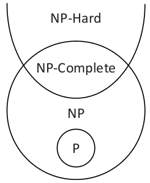

% Clase 5. Reducciones. Completitud en NP.

# Reducciones entre lenguajes

## Reducción de Karp

Sea $A, B$ dos lenguajes.

A es *reducible en tiempo polinomial* a $B$
si existe una función $f$ computable en tiempo polinomial
tal que para todo $x$, $x \in A$ ssi $f(x)\in B$.

Notación: $A \leq_{p} B$.

## Observaciones

> * una reducción de A a B "mapea" las instancias de A a instancias de
    B, y las no-instancias de A a no-instancias de B
> * pero no siempre una instancia de B tiene una pre-imagen en A según
>   esa reducción

## Ejemplo: 3COLOR $\leq_p$ SAT

> * 3COLOR: lenguaje de los grafos que se pueden colorear con 3 colores
>   sin que una arista conecte dos nodos del mismo color.
> * SAT: lenguaje de las formulas booleanas escritas como conjuntos de
>   claúsulas relacionando 3 variables o menos, satisfactibles.

## Ejemplo: 3COLOR $\leq_p$ SAT

Traducción $G \mapsto \varphi_G$ que transforma cualquier grafo $G$ en una formula
proposicional $\varphi_G$.

> * variables $c_{ij}$ que valen 1 si el nodo $i$ está colorado con el color $j$, 0 sino
> * cláusulas que indican que todo nodo tiene que tener un color 
> * cláusulas que indican que todo nodo no puede tener más de un color
> * cláusulas que indican que dos nodos conectados no pueden tener el mismo color

## Ejemplo: 3COLOR $\leq_p$ SAT

Luego afirmamos que si G tiene un coloreo entonces $\varphi_G$ tiene una asignación de valores
que la satisface.

Y, afirmamos que si $\varphi_G$ tiene una asignación que la satisface, entonces G tiene un coloreo (con 3 colores).

## Proposiciones

> * si $A \leq_p B$ y $B \in$ **P** entonces $A \in$ **P**
> * $\leq_p$ es transitiva

# Lenguajes completos para **NP**

## Definiciones

> * El lenguaje $B$ es **NP** difícil si para todo $A\in$ **NP**, $A \leq_p B$.
> * El lenguaje $B$ es **NP** completo si además de lo anterior, está en **NP**.
> * Teorema de Cook-Levin: SAT es NP-completo
> * O sea, SAT puede simular eficientemente cualquier lenguaje en **NP**

## Demostración del Teorema de Cook-Levin

Pasos:

> 1. SAT $\leq_p$ CircuitSAT
> 2. CircuitSAT es NP-completo

## Paso 1: CircuitSAT

Un *circuito booleano* es un objeto donde empezamos con $n$ variables x1, x2, ... xn,
y podemos definir variables nuevas con el AND, OR, o NOT de variables existentes:

~~~
x{n+1} = x3 or xn
x{n+2} = not(x{n+1})
x{n+3} = x1 and x{n+2}
... 
~~~

CircuitSAT: circuitos tales que existe una asignación de valores para x1 ... xn tal que la última variable vale 1.

## CircuitSAT $\leq_p$ SAT , por qué?

Cada vez que calculamos un AND, OR o NOT, relacionamos una variable nueva con una o dos
viejas. Cada relación se puede expresar con un conjunto de cláusulas, por ejemplo:

~~~
x{n+1} = x3 or xn
~~~

Se traduce a:

~~~
x{n+1} or not(x3)
x{n+1} or not(xn)
not(x{n+1}) or x3 or xn 
~~~

Y así. Entonces **CircuitSAT** $\leq_p$ **SAT**.

## Paso 2.a.

> * Sea algun $L \in$ **NP**. Por definición, existe una MT
>   M tal que $x\in L$ ssi existe un certificado $u$
>   que hace que M(x,u) acepte.
> * Sin pérdida de generalidad, M tiene una sola cinta
> * Creamos un circuito $\varphi$ que "imite" M,
>   o sea, tal que existe una asignación de valores de las variables de entrada
>   que lo hace evaluar a 1 ssi existe una string $u$ que hace que M acepte (x,u).
> * ¿Pero cómo? ¡definiendo un montón de variables!

## Parte 2.b.

> * una variable que valdrá 1 ssi el bit de posición 37 de la cinta de M está puesto a 1 en
>   el paso 42 de la ejecución de M.
> * otra variable que valdra 1 ssi el bit en posición 14 está puesto a 1
>   en el paso 52 de la ejecución.
> * otra variable que valdrá 1 ssi el cabezal de M está en la posicion 74 de
>   la cinta y el estado interno de M es el número 15, en el paso 33.
> * Y así...

## Parte 2.c.

> * escribimos un montón de relaciones lógicas entre esas variables
> * describen el comportamiento de M
> * Si el bit 17 de la cinta es 0 en el paso 22, y el cabezal no está sobre el bit 17 en ese momento, entonces
>   el bit 17 seguira siendo 0 en el paso 23.
> * Si M está en estado interno 5 en el paso 44, y lee un 1, y la función de transición de M indica
>   que debe pasar al estado 7, entonces M estará en el estado interno 7 en el paso 45.
> * Y así...

## Parte 2.d.

> * todo esto sigue siendo una cantidad *polinomial* de variables y relaciones
> * las entradas del circuito son las variables que representan $u$ en la cinta de M
> * entonces, dado x, tenemos un circuito polinomialmente más grande que x,
>   y es satisfactible ssi existe un certificado $u$ que haga que M(x,u) acepte
> * entonces L $\leq_p$ CircuitSAT
> * CircuitSAT es NP-completo. SAT también.

## Comentario

* Si llegamos a mostrar que algun lenguaje **NP**-difícil está en **P** entonces **P**=**NP**
* Se sospecha que **P** ≠ **NP** (aunque no esté demostrado), entonces
  **SAT** es más difícil de resolver que cualquier problema
  en **P**

