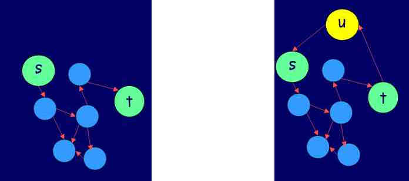

% Preparación al Parcial 1

# 1. Mostrar que un lenguaje es decidible (3 puntos)

Mostrar que el lenguaje binario siguiente es decidible:

$L = \{ 1^n0^m1^{(n+m)} \mid n,m \in \mathbb{N} \}$

Hacerlo describiendo una máquina de Turing que lo decida.

# 2. Mostrar que un lenguaje pertenece a **P** (2 puntos)

$S = \{ (n,m) \mid n \in \mathbb{N}, m = 1 + 2 + ... + n \}$

# 3. Mostrar que un lenguaje pertenece a **NP** (3 puntos)

Este es un lenguaje adaptado del problema "longest increasing subsequence":

$LIS = \{ (L, k) \mid k \in \mathbb{N} , L$ es una secuencia de enteros y tiene una subsecuencia creciente de tamaño $k \}$.

Por ejemplo, $(\{0, 8, 4, 12, 2, 10, 6, 14, 1, 9, 5, 13, 3, 11, 7, 15\}, 6) \in LIS$
dado que la secuencia tiene la subsecuencia de tamaño 6 siguiente: $\{ 0, 2, 6, 9, 11, 15. \}$

En cambio, $(\{2, 5, 4, 1\}, 3) \notin LIS$.

Mostrar que $LIS \in$ **NP**.

# 4. Reducción polinomial entre dos lenguajes (2 puntos)

Consideremos los dos lenguajes siguientes:

* stHam = $\{ (G,s,t) \mid G = (E,V), s \neq  t \in V$, existe un camino desde s hasta t que pasa por cada nodo solo una vez $\}$
* Ham = $\{<G>\mid$ existe un ciclo en G  que atraviesa cada nodo exactamente una vez $\}$

Sea $f$ la función que transforma un triple $(G = (V,E), s, t)$ en un grafo $G' = (V \cup {u}, E \cup \{(u,s),(t,u)\})$,
es decir hace la transformación siguiente:

¿Por qué tenemos una reducción polinomial entre estos dos lenguajes? ¿En qué dirección?
