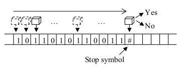
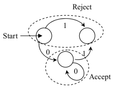
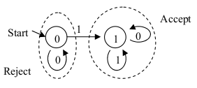
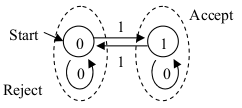
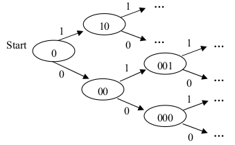

% Automatas finitos Deterministas

# Autómatas

## Idea general

Pensar en una máquina de Turing simplificada que solo puede leer la cinta de input, y solo puede
moverse hacia la derecha cada paso de su ejecución.

Nunca entra en un bucle infinito, siempre termina su ejecución contestando sí o no.

## Autómata finito determinista

Este autómata tiene un estado interno, y según el símbolo que lee, puede cambiar de
estado interno.

Tiene un estado inicial, con el cual empieza su ejecución, y según en qué estado
está después de leer la palabra de entrada, acepta o rechaza dicha palabra.

La cantidad de estados es finita.

## Ejemplo 1

Un automata con 3 estados, sobre alfabeto 0,1. Según la palabra que recibe como input,
su estado final será de aceptación o rechazo:

(No hace nada particular.)

## Ejemplo 2

Este autómata determina si existe algun 1 en la palabra de input:

## Ejemplo 3

Este autómata determina si hay una cantidad par o impar de 1s en la palabra de input:

## ¿autómata para CAP?

Si sabemos que tenemos un input de tamaño $N$, podríamos definir un autómata de $2^N$ estados
que detecte las palabras capícuas.

¿Se puede para el caso general donde tenemos inputs
de cualquier tamaño?

## Definición

Un autómata finito determinista (AFD) tiene:

 1. Un conjunto finito de estados $Q$.
 2. Un conjunto finito de símbolos de entrada $Σ$.
 3. Una función de transición $δ : Q \times Σ \mapsto Q$.
 4. Un estado inicial $q_0 \in Q$.
 5. Un conjunto de estados de aceptación $F \subseteq Q$.

## Lenguaje de un AFD

El lenguaje de un AFD $A=(Q, Σ, δ , q_0 , F)$ es:

$L(A) = \{w \mid \delta(q_0,w) \in F \}$

Decimos que $L$ es un *lenguaje regular* si es el lenguaje de un AFD.

# Ejercicios

## Ejercicio 1

Describa los AFD que aceptan los siguientes lenguajes con el alfabeto $\{0, 1\}$:

 a) El conjunto las cadenas que terminan en 00.
 b) El conjunto las cadenas con tres 0s consecutivos (no necesariamente al final).
 c) El conjunto de cadenas que contengan la subcadena 011.

## Ejercicio 2

Considere el AFD cuya tabla de transición es:

~~~
       0 | 1
--------------
-> A | A | B
 * B | B | A
--------------
~~~

Describa informalmente el lenguaje de este AFD.

Misma pregunta para el AFD siguiente: 

~~~
         0 | 1
-----------------
-> * A | B | A
   * B | C | A
     C | C | C
-----------------
~~~

# Comparaciones con máquinas de Turing

## Volvendo a CAP

¿Cómo demostrar que un lenguaje *no* es regular?

Para CAP (el lenguaje de las strings capicuas) podemos usar el principio del palomar
(o del juego de las sillas) para mostrar que no es regular.

## CAP no es regular 1

Mostremos que ningun AFD puede ser construido tal que pueda detectar si una string
cualquiera es capicua. Para empezar, partimos una capicua al medio. Vamos a ignorar
todo acerca del automata finito salvo su estado en el punto medio. Cualquier
información que el automata va a llevar a la segunda mitad de la string debe estar
codificada en ese estado.

## CAP no es regular 2

* Un automata finito debe tener una cantidad finita de estados.
* Pero hay una cantidad infinita de primeras mitades de strings posibles.
* Entonces existe por lo menos un estado que tiene "doble empleo", es decir,
  que dos primeras mitades de strings nos llevan al mismo estado.

## CAP no es regular 3

Consideremos dos capicuas $x \neq y$, $|x| = |y|$ aceptados por el autómata.
Entonces el autómata estará en el mismo estado cuando llegue a la mitad de $x$ e $y$.

Armemos una string nueva $z$ cruzando la primera mitad de $x$ y la segunda mitad de $y$:

* $z$ debe ser aceptada también por el automata
* $z$ no es capicua

Entonces ningún automata finito puede reconocer todas las capicuas.

