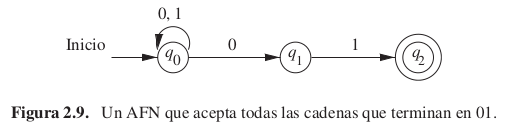
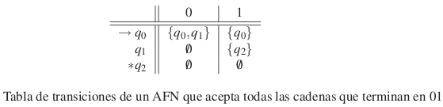
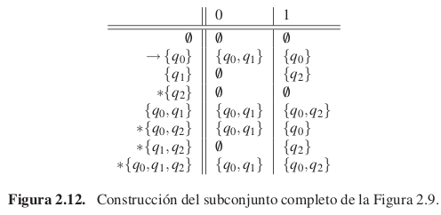
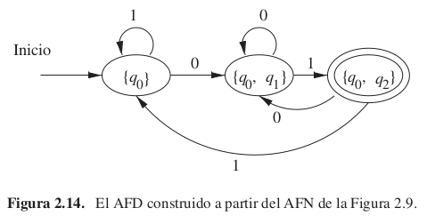
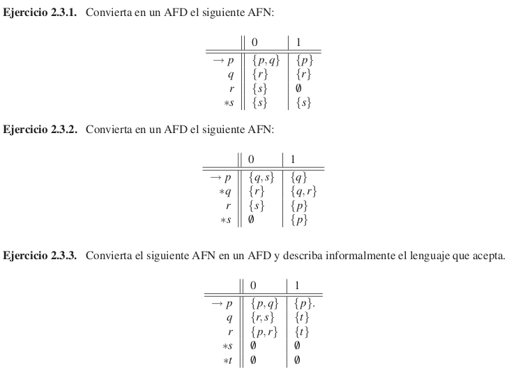
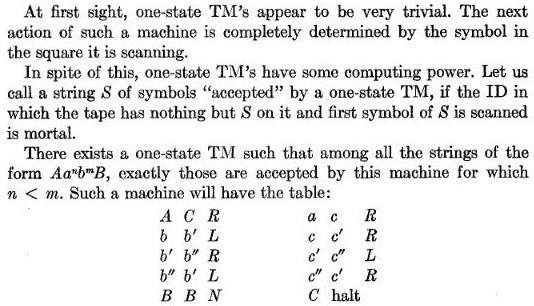
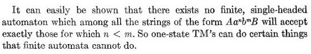

% Automatas finitos no deterministas

# Introduccion

## Aproximación 1 

Un autómata finito “no determinista” (AFN) tiene la capacidad de estar en varios estados a la vez.

Puede "conjeturar" sobre su entrada.

Por ejemplo, cuando se buscan determinadas palabras dentro de una cadena de texto larga, resulta útil "conjeturar" que estamos al principio de una de estas palabras y utilizar una secuencia de estados únicamente para comprobar su aparición, carácter por carácter.

## Aproximación 2

Un AFN es muy parecido a un AFD, de hecho su definición es casi igual.

La diferencia entre los AFD y los AFN se encuentra en el tipo de función de transición δ.

En los AFN, δ devuelve un *conjunto* de estados en lugar de devolver exactamente un estado.

## Ejemplo

* $q_0$ "conjetura" que estamos por leer el `01` final
* es posible que el siguiente símbolo no sea el comienzo de la cadena `01`
  final, por eso los bucles
* no hay transición desde $q_1$ con 0, tampoco ninguna desde $q_2$.
  En estos casos el hilo "muere".

Ejemplo con entrada `00101`.

## Tabla de transición

# Equivalencia con AFD

## El lenguaje de un AFN

* un AFN acepta una cadena $w$ si es posible elegir alguna secuencia de opciones
  del estado siguiente, a medida que se leen los caracteres de $w$, que llega del estado inicial a cualquier estado
  de aceptación
* que otras secuencias nos lleven a un estado de
  no aceptación, o no lleven a ningún estado en absoluto (es decir, la secuencia "muere"), no impide
  que w sea aceptada por el AFN

## Formalmente

Si $A=(Q, Σ, δ , q_0 , F)$ es un AFN, entonces

$L(A) = \{w | δ(q_0 , w) \cap  F  \neq 0\}$

L(A) es el conjunto de cadenas w tal que $δ(q_0 , w)$ *contiene al menos un estado de aceptación*.

## Pregunta

Ya vimos que el conjunto de los lenguajes decidibles (por MTs) y de los lenguajes
regulares (por AFDs) eran distintos (porque CAP es decidible pero no regular).

¿Qué pasa con el conjunto de lenguajes de los AFN? ¿Es distinto del conjunto de lenguajes regulares?

## ¡Es el mismo conjunto!

Si tenemos un AFN con estados Q,
se puede construir un AFD que acepta el mismo lenguaje, con estados $2^Q$:

* su estado inicial es $\{q_0\}$
* sus estados finales son los de $2^Q$ que contengan algún estado final de $Q$
* su función de transición es determinista y definida según la del AFN

En el peor caso pasamos de $n$ estados a $2^n$ estados pero en la práctica es poco común.

## Ejemplo conversión AFN en AFD

## Ejemplo conversión AFN en AFD

# Ejercicios

## Conversión de AFN a AFD

<!-- 

## Ejercicio facultativo

"The uniform halting problem for generalized one state
Turing machines", Hermann. -->
