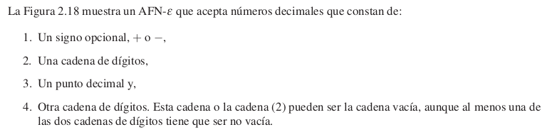
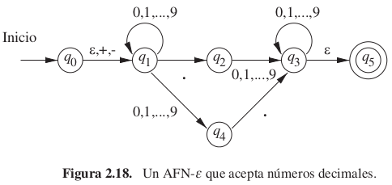
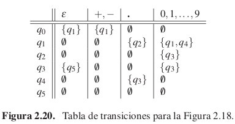
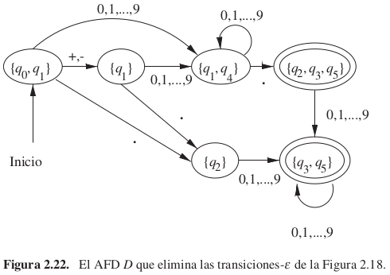
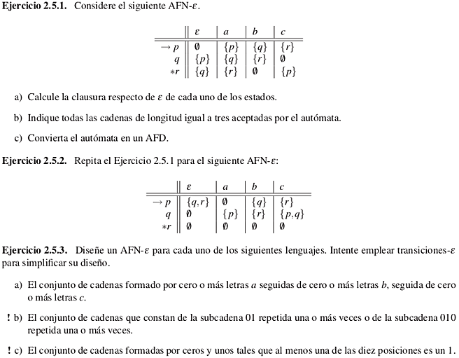

% Automatas finitos con transiciones $\epsilon$

# Introducción

## Idea

Veamos otra extensión del autómata finito. La nueva característica es que permite transiciones
para ε , la cadena vacía. Así, un AFN puede hacer una transición espontáneamente, sin recibir un símbolo de
entrada.

Al igual que el no determinismo, esta nueva capacidad no
expande la clase de lenguajes que los autómatas finitos pueden aceptar, pero proporciona algunas "facilidades
de programación".

## Ejemplo

## Ejemplo

## Notación formal para un AFN-e

Podemos representar un AFN-ε del mismo modo que representaríamos un AFN con una excepción: la función
de transición tiene que incluir la información sobre las transiciones para ε.

## Definición clausura

La clausura de un estado $q$ respecto de ε, es el conjunto de estados que incluye
a $q$ y también a todos los estados accesibles por una o varias transiciones ε desde $q$.

Notación: $CL(q)$.

## Función de transición extendida

En primer lugar, definimos $δ'$, la función de transición extendida, para reflejar lo
que ocurre con una secuencia de entradas. La idea es que $δ'(q, w)$ es el conjunto
de estados que puede alcanzarse a lo largo de un camino cuyas etiquetas, cuando se concatenan,
forman la cadena $w$ (sin las etiquetas ε).

# AFN-es y AFDs

## Lenguaje de un AFN-e

Sea $E = (Q, Σ, δ , q_0 , F)$ un AFN-e.

$L(E) = \{w | δ'(q_0, w) \cap F  \neq \emptyset  \}$.

El lenguaje de E es el conjunto de cadenas w que llevan del estado
inicial a al menos un estado de aceptación.

## Conversión de AFN-e a AFD

Parecida a la conversión de AFN a AFD.

Sea E un AFN-e de conjunto de estados Q. Existe un AFD equivalente con:

* conjunto estados $2^Q$ pero solo con subconjuntos cerrados respecto de e,
  es decir aquellos subconjuntos $S$ tales que $CL(S)=S$.
* estado inicial = $CL(q_0)$
* estados finales, idem que desde AFN
* (sigue)

## Función de transición 

Se calcula $δ_D(S,a)$ para todo $a$ perteneciente a $Σ$ y todos los conjuntos $S$
pertenecientes a $Q_D$ como sigue:

1. Sea $S = \{p_1 , p_2 , \ldots , p_k \}$
2. Calculamos $\bigcup_i δ (p_i , a) = \{r_1, r_2, \ldots, r_m\}$.
3. Luego $δ_D(S,a) = \bigcup_j CL(r_j)$.

## Ejemplo

# Ejercicios

## Ejercicios

