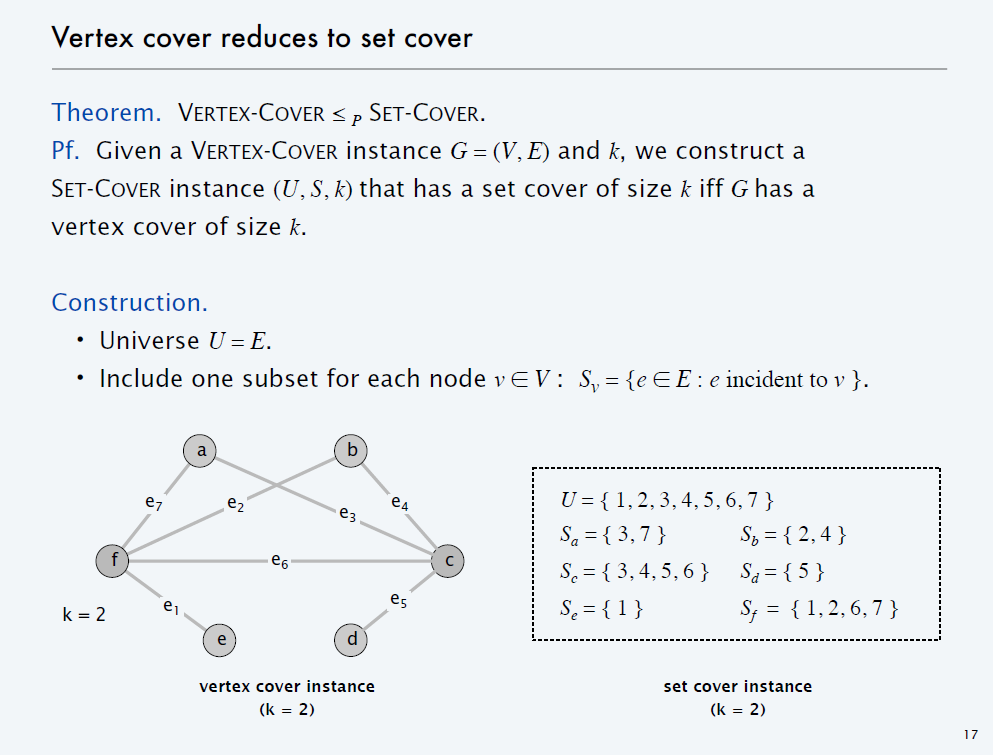

% MD3-computabilidad, parcial 1
% 2019-10-16

No se pueden consultar apuntes, buscar por internet o comunicar con otra gente.

Se entregan las respuestas por escrito sobre papel.

Duración del parcial: 1 hora.

# 1. Mostrar que un lenguaje es decidible (3 puntos)

Mostrar que el lenguaje binario siguiente es decidible:

$L = \{ 1^n001^n \mid n > 0 \}$

Por ejemplo las palabras siguientes pertenecen a $L$:

* $1001$
* $110011$
* $111110011111$

Las siguientes NO pertencen a $L$:

* $100$
* $001$
* $101$
* $1111$
* la palabra vacía

Describir una máquina de Turing que lo decida.

# 2. Mostrar que un lenguaje pertenece a **P** (2 puntos)

Mostrar que el lenguaje siguiente pertenece a la clase **P**:

`S = { G | G es un grafo que contiene un nodo n que está conectado con todos los otros nodos }`

Suponer que $G=(E,V)$ donde $E$ es el conjunto de nodos y $V$ el conjunto de aristas.

# 3. Mostrar que un lenguaje pertenece a **NP** (3 puntos)

Consideremos el problema "subset sum":
dado un conjunto de enteros, ¿existe algún subconjunto cuya suma sea exactamente cero?

Por ejemplo, si consideramos `{ −7, −3, −2, 5, 8}`, la respuesta es sí, dado que
el subconjunto `{ −3, −2, 5}` suma cero.

Explicar por qué el lenguaje que corresponde a este problema está en **NP**.

# 4. Reducción polinomial entre dos lenguajes (2 puntos)

## SETCOVER

Dado un conjunto de elementos 1,2, ... n , (llamado universo) y una colección S de m conjuntos cuya unión
es igual al universo, y un entero k, el problema SETCOVER consiste en identificar la sub-colección de S cuya unión es igual
al universo.

Más precisamente:

`SETCOVER = { (S,k) |  S es una colección de m conjuntos, tal que existe una sub-colección de k conjuntos cuya unión es igual a la unión de todos los sub-conjuntos }` 

Por ejemplo: sea el universo `{1,2,3,4,5}`, y la colección `S = { {1,2,3} , {2,4} , {3,4} , {4,5} }`.
`(S,2)` pertenece  a SETCOVER, dado que esta sub-colección cubre el universo: `{ {1,2,3} , {4,5} }`.

## VERTEXCOVER

Dado un grafo $G=(E,V)$, y un entero k, el problema VERTEXCOVER consiste en identificar si se pueden seleccionar k nodos que, juntos,
están conectados con todos los nodos del grafo.

`VERTEXCOVER = {G=(E,V) | G es un grafo que tiene k nodos tales que todos los nodos del grafo están conectados con alguno de esos k nodos}`

Ejemplo de un grafo G tal que (G,2) pertenece a VERTEXCOVER pero (G,1) no pertenece:

## La reducción

Verificar que la reducción propuesta en esta imagen cumple con la definición de reducción polinomial.
