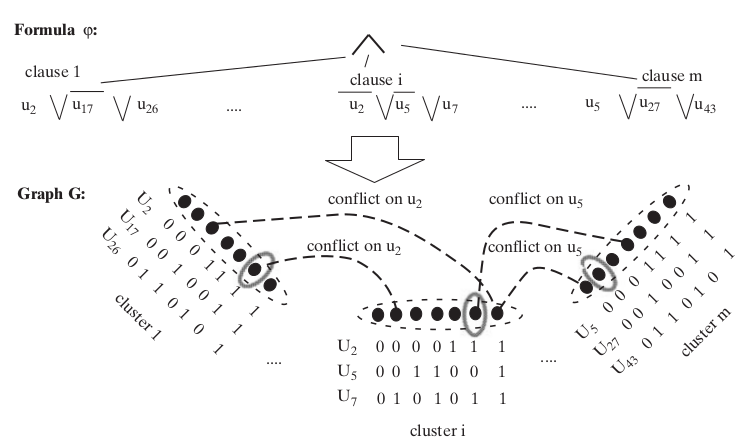

# INDSET es **NP** completo

INDSET =
  $\{\lfloor (G,k) \rfloor \mid\exists S\subseteq N(G),|S|\geq k,\forall uv\in S, uv\not\in E(G)\}$

INDSET $\in$ **NP** porque el certificado es el conjunto $S$.

Mostramos 3SAT $\leq_p$ INDSET.

---

Sea $\varphi = \bigwedge C_i$ una formula en FNC3.
Sea $m$ el número de cláusulas de $\varphi$, construimos un grafo $G$ tal que
$\lfloor \varphi \rfloor \in 3SAT \leftrightarrow \lfloor (G,m) \rfloor \in INDSET$.

Cada cláusula $C$ de $\varphi$ tiene ≤ 3 literales, entonces
hay ≤ 7 asignaciones que la satisfacen.

Construimos para $C$ un cluster de 7 nodos, marquamos cada uno con
las asignaciones que satisfacen su cluster.

Conectamos dos puntos si pertenecen a clusters distintos y representan asignaciones
inconsistentes (ie, 1 variables es asignada a 1 en un nodo y 0
en el otro).

Conectamos entre si todos los puntos de un mismo cluster.

---

---

  * La transformación se puede hacer en tiempo polinomial.
  * $\varphi$ satisfacible → existe asignación $z$ tal que $\varphi(z)=1$ 
    → definir $S$ los nodos de cada cluster que corresponden a la restriccion de $z$
    a las variables del cluster  → hay $m$ nodos no conectados entre si en $G$
  * hay $m$ nodos no conectados entre si en $G$ 
    → pertenecen a clusters distintos 
    → las asignaciones parciales que esos nodos representan son consistentes 
    → con ellas construimos $z$ tal que $\varphi(z)=1$ 
    → $\varphi$ satisfacible

# VERTEXCOVER es **NP** completo

Reducción descrita en Sipser, teorema 7.44.

