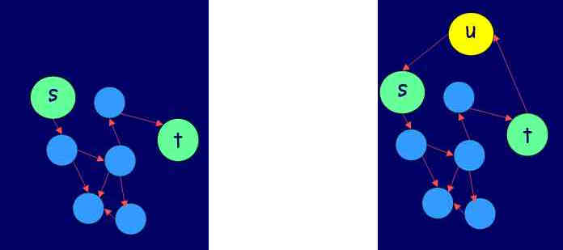

% MD3-computabilidad, preparación al parcial 1

El parcial suma 50 puntos.

# 1. Mostrar que un lenguaje es decidible (10 puntos)

Mostrar que el lenguaje binario siguiente es decidible:

$L = \{ 1^n0^m1^{(n+m)} \mid n,m \in \mathbb{N} \}$

Hacerlo describiendo una máquina de Turing que lo decida.

# 2. Mostrar que un lenguaje pertenece a **TIME(T(n))** (10 puntos)

Demostrar que el lenguaje anterior pertenece a **TIME(n)**
(para una entrada de tamaño $n$, se decide en $O(n)$ pasos).

# 3. Mostrar que un lenguaje pertenece a **P** (10 puntos)

$S = \{ <(n,m)> \mid n \in \mathbb{N}, m = 1 + 2 + ... + n \}$

# 4. Mostrar que un lenguaje pertenece a **NP** (10 puntos)

El problema de la autopista con peajes (*turnpike problem*) es el siguiente:

Tenemos $n$ puntos que debemos colocar en una línea recta (o $n$ peajes a colocar
en una autopista).

Tenemos una lista de $n(n - 1) / 2$ distancias entre cada par de puntos (distintos),
sin saber a qué puntos se corresponden esas distancias.

¿Es posible colocar esos $n$ puntos en una línea respetando esas distancias?

Mostrar que ese lenguaje está en **NP**.

# 5. Mostrar que existe una reducción polinomial entre dos lenguajes (10 puntos)

Consideremos los dos lenguajes siguientes:

* stHam = $\{ <G,s,t> \mid G = (E,V), s \neq  t \in V$, existe un camino desde s hasta t que pasa por cada nodo solo una vez $\}$
* Ham = $\{<G>\mid$ existe un ciclo en G  que atraviesa cada nodo exactamente una vez $\}$

Sea $f$ la función que transforma un triple $<G = (V,E), s, t>$ en un grafo <G' = (V \cup {u}, E \cup \{(u,s),(t,u)\})>,
es decir hace la transformación siguiente:

¿Porqué tenemos una reducción polinomial entre estos dos lenguajes? ¿En qué dirección?
