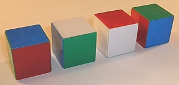
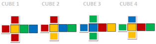

% Teórico: Clases Multiples y Dependencias Funcionales

# Multi Parameters Type Classes (Clases de Tipos Múltiples)

## Idea

Son clases de tipos que se aplican a dos tipos o más:

~~~haskell
{-# LANGUAGE MultiParamTypeClasses #-}

class context => C a b where
  ...

class context => D a b c where
  ...
~~~

## Ejemplo 1

~~~haskell
class Cast a b where
  cast :: a -> b

instance Cast Int Float where
  cast = convertIntToFloat

instance Cast Int String where
  cast = show

instance Cast String Int where
  cast = read

instance Cast Char String where
  cast c = [c]
~~~

## Ejemplo 2

~~~haskell
class (Real a, Fractional b) => RealToFrac a b where
    realToFrac :: a -> b

instance (Real a, Fractional a) => RealToFrac a a where
    realToFrac = id
~~~

De la librería [logfloat](http://hackage.haskell.org/package/logfloat/docs/Data-Number-RealToFrac.html).

## Ejemplo 3

~~~haskell
class Eq e => Collection c e where
    insert :: c -> e -> c
    member :: c -> e -> Bool

instance Eq a => Collection [a] a where
    insert xs x = x:xs
    member = flip elem
~~~

## Problemas recurrentes con las clases múltiples

~~~haskell
class Eq e => Collection c e where
    insert :: c -> e -> c
    member :: c -> e -> Bool
~~~

~~~haskell
ins2 xs a b = insert ( insert xs a ) b
~~~

. . .

~~~haskell
> :t ins2
ins2 :: (Collection c e1, Collection c e2) => c -> e2 -> e1 -> c
~~~

Tiene solucion: especificar el tipo de `ins2`.

~~~haskell
ins2 ::  (Collection c e) => c -> e -> e -> c
~~~

Sorprendente, pero no grave.

## Problema de tipos ambiguos

~~~haskell
class Eq e => Collection c e where
    insert :: c -> e -> c
    member :: c -> e -> Bool
~~~

Si le agregamos la funcion `empty :: c`, ¿qué pasa?

**¡Boom!**

~~~haskell
error:
    • Could not deduce (Collection c e0)
      from the context: Collection c e
        bound by the type signature for:
                   empty :: forall c e. Collection c e => c
      The type variable ‘e0’ is ambiguous
    • In the ambiguity check for ‘empty’
      To defer the ambiguity check to use sites, enable AllowAmbiguousTypes
      When checking the class method:
        empty :: forall c e. Collection c e => c
      In the class declaration for ‘Collection’
  |
  |     empty :: c
  |     ^^^^^^^^^^
~~~

# Functional Dependencies (dependencias funcionales)

## Aproximación a una solución

Una multiclase define una relación, pero a menudo,
lo que queremos realmente es una *función*: cuando
se determina el primer tipo, el segundo tipo es consecuencia
de ese primer tipo.

~~~haskell
{-# LANGUAGE MultiParamTypeClasses #-}
{-# LANGUAGE FunctionalDependencies #-}

class Eq e => Collection c e | c -> e where
    empty  :: c
    insert :: c -> e -> c
    member :: c -> e -> Bool
~~~

## Extensions vs. sistema de tipos por defecto

¿Porqué las multiclases y las funcional dependencies no son parte
del sistema de tipos por defecto de Haskell?

Porque las clases múltiples sin dependencias funcionales son medio
incompletas/inútiles, y las dependencias funcionales no son decidibles
en general:

~~~haskell
class Mul a b c | a b -> c where
  mul :: a -> b -> c

type Vec b = [b]
instance Mul a b c => Mul a (Vec b) (Vec c) where
 mul a bs = map (mul a) bs

f b x y = if b then  mul  x [y] else y
~~~

Consecuencia:

~~~
error:
    • Reduction stack overflow; size = 201
      When simplifying the following type: Mul a0 [Vec c] (Vec c)
~~~

[fuente](https://www.microsoft.com/en-us/research/wp-content/uploads/2016/02/jfp06.pdf)

(Se inventó otra extensión para solucionar eso, Type Families.)

## ¡Las dependencias funcionales son divertidas!

Vamos a ver en el práctico que podemos codificar, al nivel de los tipos,
enteros (con codificación unaria), y definir la suma y la multiplicación sobre ellos,
y luego definir listas y ordenamiento de listas.

También se puede [resolver el rompecabezas "Locura instantánea" ("Instant Insanity")](https://wiki.haskell.org/wikiupload/d/dd/TMR-Issue8.pdf) con clases múltiples y dependencias funcionales.

## Para explorar

* GHC User Guide: <https://downloads.haskell.org/~ghc/latest/docs/html/users_guide/>
* <https://downloads.haskell.org/~ghc/latest/docs/html/users_guide/glasgow_exts.html#type-families>
* [lógica propositional al nivel de los tipos](https://typesandkinds.wordpress.com/2012/12/01/decidable-propositional-equality-in-haskell/)

Types families: una alternativa a functional dependencies:

  * <https://wiki.haskell.org/Functional_dependencies_vs._type_families>
  * <https://ocharles.org.uk/blog/posts/2014-12-12-type-families.html>
  * <https://ocharles.org.uk/blog/posts/2014-12-13-multi-param-type-classes.html>
  * <https://ocharles.org.uk/blog/posts/2014-12-14-functional-dependencies.html>
  * <https://dikgwahlapiso.wordpress.com/2015/08/30/moving-from-multiparameter-type-classes-and-functional-dependencies-to-type-families-in-haskell/>
  * <https://byorgey.wordpress.com/2010/06/29/typed-type-level-programming-in-haskell-part-i-functional-dependencies/>

