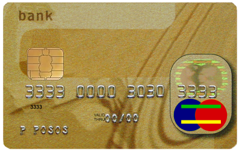

% Práctico Haskell 3: Listas y recursividad

# Ejercicios varios

Copiar y resolver estas definiciones en un módulo Haskell.
Consignas adicionales:

* no usar `head` or `tail`, usar ajustes de patrones sobre listas
* las variables que no se usan en patrones, deben ser reemplazadas por `_` (guión bajo)

~~~haskell
-- ---------------------------------------------------------------------
-- Ejercicio 1. Definir por recursion la funcion
--    potencia :: Integer -> Integer -> Integer
-- tal que (potencia x n) es x elevado al numero natural n. Por ejemplo,  
--    potencia 2 3  ==  8
-- ---------------------------------------------------------------------

potencia :: Integer -> Integer -> Integer
potencia = undefined

-- ---------------------------------------------------------------------
-- Ejercicio 2. Dados dos numeros naturales, a y b, es posible
-- calcular su maximo común divisor mediante el Algoritmo de
-- Euclides. Este algoritmo se puede resumir en la siguiente formula:
--    mcd(a,b) = a,                   si b = 0
--             = mcd (b, a módulo b), si b > 0
-- 
-- Definir la funcion 
--    mcd :: Integer -> Integer -> Integer
-- tal que (mcd a b) es el maximo comun divisor de a y b calculado
-- mediante el algoritmo de Euclides. Por ejemplo,
--    mcd 30 45  ==  15
-- ---------------------------------------------------------------------

mcd :: Integer -> Integer -> Integer
mcd = undefined

-- ---------------------------------------------------------------------
-- Ejercicio 3. Definir por recursion la función
--    and' :: [Bool] -> Bool
-- tal que (and' xs) se verifica si todos los elementos de xs son
-- verdadero. Por ejemplo,
--    and' [1+2 < 4, 2:[3] == [2,3]]  ==  True
--    and' [1+2 < 3, 2:[3] == [2,3]]  ==  False
-- ---------------------------------------------------------------------

and' :: [Bool] -> Bool
and' = undefined

-- ---------------------------------------------------------------------
-- Ejercicio 4. Definir por recursion la funcion
--    last' :: [a] -> a
-- tal que (last xs) es el ultimo elemento de xs. Por ejemplo,
--    last' [2,3,5]  =>  5
-- ---------------------------------------------------------------------

last' :: [a] -> a
last' = undefined

-- ---------------------------------------------------------------------
-- Ejercicio 5. Definir por recursion la funcion
--    concat' :: [[a]] -> [a]
-- tal que (concat' xss) es la lista obtenida concatenando las listas de
-- xss. Por ejemplo,
--    concat' [[1..3],[5..7],[8..10]]  ==  [1,2,3,5,6,7,8,9,10]
-- ---------------------------------------------------------------------
 
concat' :: [[a]] -> [a]
concat' = undefined

-- ---------------------------------------------------------------------
-- Ejercicio 6. Definir por recursion la funcion
--    selecciona :: [a] -> Int -> a
-- tal que (selecciona xs n) es el n-esimo elemento de xs. Por ejemplo,
--    selecciona [2,3,5,7] 2  ==  5 
-- ---------------------------------------------------------------------

selecciona :: [a] -> Int -> a
selecciona = undefined

-- ---------------------------------------------------------------------
-- Ejercicio 7. Definir por recursion la funcion
--    take' :: Int -> [a] -> [a]
-- tal que (take' n xs) es la lista de los n primeros elementos de
-- xs. Por ejemplo, 
--    take' 3 [4..12]  =>  [4,5,6]
-- ---------------------------------------------------------------------

take' :: Int -> [a] -> [a]
take' = undefined

-- ---------------------------------------------------------------------
-- Ejercicio 8. Definir por recursion la funcion
--    replicate' :: Int -> a -> [a]
-- tal que (replicate' n x) es la lista formado por n copias del
-- elemento x. Por ejemplo,
--    replicate' 3 2  ==  [2,2,2]
-- ---------------------------------------------------------------------
 
replicate' :: Int -> a -> [a]
replicate' = undefined

-- ---------------------------------------------------------------------
-- Ejercicio 9. Definir por recursion la funcion
--    elem' :: Eq a => a -> [a] -> Bool
-- tal que (elem' x xs) se verifica si x pertenece a la lista xs. Por
-- ejemplo, 
--    elem' 3 [2,3,5]  ==  True
--    elem' 4 [2,3,5]  ==  False
-- ---------------------------------------------------------------------

elem' :: Eq a => a -> [a] -> Bool
elem' = undefined

-- ---------------------------------------------------------------------
-- Ejercicio 10. Definir la funcion
--    refinada :: [Float] -> [Float]
-- tal que (refinada xs) es la lista obtenida intercalando entre cada
-- dos elementos consecutivos de xs su media aritmetica. Por ejemplo,
--    refinada [2,7,1,8]  ==  [2.0,4.5,7.0,4.0,1.0,4.5,8.0]
--    refinada [2]        ==  [2.0]
--    refinada []         ==  []
-- ---------------------------------------------------------------------

refinada :: [Float] -> [Float]
refinada = undefined
~~~

# Validar tarjetas de crédito

¿Alguna vez te preguntaste como hacían los sitios web para validar
tu tarjeta de crédito cuando comprás en línea? No buscan en una base
de datos gigantesca, tampoco usan magia. En realidad, la
mayoría de los proveedores de tarjetas de crédito usan una fórmula
para distinguir números válidos de números aleatorios (o de errores de tipeo).

En este ejercicio, vas a implementar el algoritmo de validación para
tarjetas de crédito. El algoritmo sigue los pasos siguientes:

* Duplicar el valor de uno de cada dos dígitos, empezando desde la derecha.
  Es decir, el último dígito no cambia; el penúltimo es duplicado;
  el anterior no cambia; y sigue así. Por ejemplo,
  `[1,3,8,6]` se vuelve `[2,3,16,6]`.
* Sumar los dígitos de los valores duplicados y los dígitos no duplicados
  del número original. Por ejemplo, `[2,3,16,6]` se vuelve
  `2+3+1+6+6 = 18`.
* Calcular el resto cuando esa suma es dividida por 10. En el ejemplo
  anterior, el resto sería `*`.
* Si el resultado es `0` entonces el número es válido.

## Parte 1

Primero necesitamos descomponer un número en su último dígito y el resto
del número. Escribí las funciones siguientes:

~~~haskell
lastDigit :: Integer -> Integer
dropLastDigit :: Integer -> Integer
~~~

Estas funciones no requieren definición recursiva.
Si te perdiste, buscá la definición los operadores aritméticos siguientes: `mod`, `div`.

Ejemplos:

~~~haskell
lastDigit 123 == 3
lastDigit 0 == 0
dropLastDigit 123 == 12
dropLastDigit 5 == 0
~~~

## Parte 2

Ahora podemos descomponer un número en sus dígitos. Definí la función

~~~haskell
toDigits :: Integer -> [Integer]
~~~

`toDigits` debe convertir enteros positivos en una lista de dígitos.
Para 0 o valores negativos, debe devolver la lista vacía.

Ejemplos:

~~~haskell
toDigits 1234 == [1,2,3,4]
toDigits 0 == []
toDigits (-17) == []
~~~

## Parte 3

Una vez que tenemos los dígitos en el orden correcto, necesitamos
duplicar uno de cada dos. Definí la función:

~~~haskell
doubleEveryOther :: [Integer] -> [Integer]
~~~

Recordá que `doubleEveryOther` debería duplicar cada otro número empezando
desde la derecha.

Es mucho más fácil llevar a cabo esta operación sobre una lista de dígitos
que está en orden inverso. Probablemente vas a necesitar definir unas
funciones auxiliares para que eso ande.

Ejemplos:

~~~haskell
doubleEveryOther [8,7,6,5] == [16,7,12,5]
doubleEveryOther [1,2,3] == [1,4,3]
~~~

## Parte 4

La salida de `doubleEveryOther` es una mezcla de números de uno y dos
dígitos. Definí la función

~~~haskell
sumDigits :: [Integer] -> Integer
~~~

para calcular la suma de todos los dígitos.

Ejemplo:

~~~haskell
sumDigits [16,7,12,5] = 1 + 6 + 7 + 1 + 2 + 5 = 22
~~~

## Parte 5

Definí la función

~~~haskell
validate :: Integer -> Bool
~~~

que indica si un entero es un número válido de tarjeta de crédito.

Usará todas las funciones definidas en las partes anteriores:

Ejemplos:

~~~haskell
validate 4012888888881881 == True
validate 4012888888881882 == False
~~~
