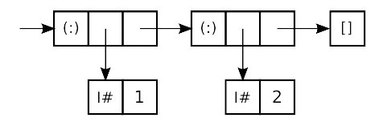

% Práctico Haskell: Entrada y Salida, ByteStrings

# Preparación

Tenés que hacer este práctico en tu computadora ya que se requiere
una librería que no está en la interfaz web `repl.it`.

Vas a necesitar 2 bibliotecas que no son parte de la libreria estándar
de Haskell. Se pueden con
un instalador de librerías llamado `cabal`. Si estás usando Windows, necesitas instalar
[Haskell Platform](https://www.haskell.org/platform/) para tener `cabal`.
Si estás usando Linux, instala el paquete llamado `cabal-install`.

Las bibliotecas que necesitás son `aeson` y `text`.  Instalalas desde
tu intefaz en línea de comando (terminal) con los comandos siguientes:

~~~bash
cabal update
cabal install aeson text
~~~

Necesitás ahora los archivos siguientes:

* [Banco.hs](https://cs.famaf.unc.edu.ar/~hoffmann/pd19/files/Banco.hs)
* [Parser.hs](https://cs.famaf.unc.edu.ar/~hoffmann/pd19/files/Parser.hs)
* [clues.zip](https://cs.famaf.unc.edu.ar/~hoffmann/pd19/files/clues.zip)

Y descomprimí `clues.zip`.

Tenés a mano el buscador  Hoogle: <https://www.haskell.org/hoogle/>,
en particular para consultar la documentación de `Data.List`, `Data.Map.Strict` y `ByteString.Lazy`.

# Archivos JSON

Este proyecto involucra analizar ("parsear") y luego buscar información
dentro de un archivo JSON. JSON es un formato de intercambio de datos
internacionalmente estandardizado que es fácil de leer y de escribir.
No hace falta que sepas mucho para este proyecto,
¡la biblioteca `aeson` hace todo el trabajo!

Lo que sí hay que hacer, es asegurarnos que nuesto programa
Haskell pueda encontrar los archivos JSON. Así que poné los archivos en la
misma capeta que tu módulo Haskell.

Si los archivos están en otra carpeta, podés probar en `GHCi` el comando
`:!pwd`. Esto va a mostrar la carpeta actual donde `GHCi` piensa que
está. Si los archivos JSON no están en la carpeta indicada, hay dos opciones.
O los podés mover ahí, o podés usar `:cd` para que `GHCi` cambie de carpeta
actual. (`:cd` es un comando de `GHCi`, la falta de `!` es a propósito).

# Como representar texto en Haskell

## El problema con las `String`

Como ya sabemos, el tipo `String` de Haskell es un sinónimo
para una lista de `Char`:

~~~haskell
type String = [Char]
~~~

Si bien es práctico, esto genera un problema con aplicaciones reales.
Por ejemplo, consideremos la lista `[1,2]` y su representación concreta en memoria:

En esta ilustración:

  * cada casilla representa una [palabra](https://es.wikipedia.org/wiki/Palabra_(inform%C3%A1tica))
    en memoria
  * las flechas representan punteros
  * cada constructor usa una palabra más, por ejemplo alguna información para
    el [recoletor de basura](https://es.wikipedia.org/wiki/Recolector_de_basura)
    (para la gestión automática de la memoria)

Entonces usar listas de caracteres es una manera horriblemente costosa
de almacenar texto en la memoria de una computadora.

## La solución de las `ByteString`

Por suerte existen otras representaciones de texto.
En este proyecto vamos a usar una que se llama `ByteString`.
De manera interna, una `ByteString` es muy parecida
a un arreglo de caracteres en `C`.

La biblioteca `ByteString` usa muchos nombres de funciones iguales a los
del `Prelude` (el módulo por defecto de Haskell) y de `Data.List`.
Si colocás simplemente `import Data.ByteString` al principio de tu módulo,
vas a tener muchos conflictos de nombres en tu código. Entonces
vamos a usar la sintaxis `import qualified ... as BS`, que significa que
cada uso de una función o tipo sobre `ByteString` (incluso los operadores)
debe ser prefijado con `BS`. Por ejemplo, para calcular el tamaño de una
`ByteString`, hay que escribir `BS.length`.

<!--
Las `ByteStrings` vienen en distintos "modelos", según qué tipo de
codificación usan internamente, o si son perezosas o estrictas (esto
es un concepto que todavía no vimos en esta materia). Para este
proyecto, vamos a usar `ByteStrings` perezosas (lazy).-->

`GHC` provee la extensión `OverloadedStrings`, que se activa con
el comentario siguiente al principio de un módulo:

~~~haskell
{-# LANGUAGE OverloadedStrings #-}
~~~

Para usar `OverloadedStrings` en `GHCi` se usa el comando
`:set -XOverloadedStrings`.

Esto funciona como los números sobrecargados, que por ejemplo,
cuando escribimos algo como `42`, no es de tipo `Int`, `Integer`
o `Float`, pero de tipo `Num a => a`.

Con `OverloadedStrings` activado, cada uso de `"blah"` en tu código fuente es
convertido en una llamada a `fromString "blah"`, donde `fromString`
es una función de la clase de tipos `IsString`
(el equivalente de `Num` pero para cadenas de caracteres).
Por supuesto, `ByteString` está en la clase `IsString`, tal como `String`.

Una consecuencia de `OverloadedStrings` es que a veces `GHC` no
sabe qué tipo de cadena de caracteres queremos, y de repente aparecen
mensajes de error extraños.  En esos casos necesitamos agregar una
anotación de tipo.

Finalmente, las `ByteStrings` son secuencias de caracteres 8-bits
tradicionales. El tipo de un carácter 8-bit en Haskell es `Word8`,
que es básicamente un entero sin signo de 8 bits. Esto es a doble hilo.
Por un lado, no podemos usar constantes como `'a'` cuando manejamos
`ByteStrings` (aunque,  podemos usar la sintaxis `"..."` como visto más arriba).
Por otro lado, los `Word8` son instancias de `Num` e `Integral`,
entonces podemos usar nuestras funciones numéricas favoritas sobre ellos.

# ¡Pánico en el Banco Haskell!

¡El Banco Haskell está en alerta! ¡Alguien hackeó el sistema haciendo
uso de la función `head`! La falla de seguridad está
arreglada, pero el delincuente pudo iniciar una serie de transacciones.

Te contrataron para encontrar quién hackeó el Banco Haskell
y qué transacciones tienen que ser revertidas para que todos los clientes
recuperen su dinero.

Por suerte, pudiste recuperar ciertos archivos que contienen pistas.
Estos archivos se encuentran en `clues.zip`. En los ejercicios siguientes,
vas a extraer los datos de esos archivos y usar las pistas para agarrar al perpetrador.

# Ejercicio 1

El delincuente guardó una lista de los identificadores de transacción
que inició. Lamentablemente, esa lista es encriptada, y el delincuente
escondió la clave en una adorable foto de perro, `dog.jpg`.
Algunos de los bytes de la imagen fuero XOR-eados con un mensaje secreto.
Para extraer el mensaje, necesitás hacer un XOR de los bytes de la
imagen alterada con la imagen original, y quitar todos los bytes que
valen 0 después de esa operación. La imagen original se encuentra en
el archivo `dog-original.jpg`.

Ahora, tenés que implementar la función:

~~~haskell
getSecret :: FilePath -> FilePath -> IO ByteString
~~~

Vas a tener que usar la función `xor` del módulo `Data.Bits`.
Recordá que `FilePath` es simplemente un sinónimo de `String`.

(Indicación: buscá la documentación del módulo `Data.Bytestring.Lazy`
y `Data.Bits` en Hoogle.)

# Ejercicio 2

Ahora que tenés la clave de encripción, podés decifrar la lista de
identificadores de transacciones falsas. Esta lista es contenida en
`victims.json.enc`.

Los datos son cifrados usando un esquema similar al Cifrado de
Vigenère. Para descifrarlos, simplemente hay que XOR-ear el texto
cifrado con la clave. Vas a tener que repetir la clave porque es mucho más
corta que el texto cifrado.

Implementá la función:

~~~haskell
decryptWithKey :: ByteString -> FilePath -> IO ()
~~~

Esta función debe leer el archivo cifrado, y decifrarlo usando la clave,
luego escribirlo en otro archivo. El parámetro `ByteString` es la clave
y el `FilePath` es el camino al archivo que debe ser escrito
(no tiene que existir). El archivo cifrado tiene el mismo camino
pero con ".enc" agregado al final.

Para probar esta función en GHCi activá la sobrecarga de cadenas de caracteres
con `:set -XOverloadedStrings`, luego podrás hacer:

~~~haskell
decryptWithKey "clave arrojada en el ejercicio anterior" "victims.json"
~~~

# Ejercicio 3

Ahora tenemos una lista de identificadores de transacciones falsas,
pero eso no te dice quién es el delincuente ni cuánta plata robó.
Por suerte, el Banco Haskell nos proveyó una lista de todas las
transacciones que ocurrieron mientras el hacker estaba en el sistema.

Esta lista en formato JSON se encuentra en el archivo
`transactions.json` (este archivo no está cifrado).
El Banco Haskell también nos proveyó el módulo de
parseo que usa para convertir datos entre los tipos Haskell y
ByteStrings JSON. Este módulo usa la biblioteca `aeson`,
se encuentra en `Parser.hs` y exporta dos funciones:

~~~haskell
encode :: ToJSON a => a -> ByteString
decode :: FromJSON a => ByteString -> Maybe a
~~~

También define instancias `FromJSON` y `ToJSON` para el tipo de datos
`Transaction`. Las instancias para `[Transaction]` son proveidas
automáticamente por `aeson`.

Esto significa que podés usar `decode` para parsear la lista de
transacciones en `transactions.json`. Los datos en `victims.json`
son solo una lista de cadenas de carácteres. `aeson` sabe
como parsear eso sin usar una instancia especial. Podés entonces
usar una función polimórfica para parsear estos dos archivos.

Definí la función:

~~~haskell
parseFile :: FromJSON a => FilePath -> IO (Maybe a)
~~~

Esta función debe tomar el camino a un archivo e intentar
parsearlo como formato JSON, en un valor de tipo `a`.

Observación: para probar en `GHCi`, necesitás indicar qué debe
ser el tipo de salida. Por ejemplo,
`parseFile "victims.json"` va a devolver  `Nothing`, pero
`parseFile "victims.json" :: IO (Maybe [TId])` te va a devolver lo
que buscás.

# Ejercicio 4

Ahora sos capaz de parsear tus archivos JSON, entonces
podés empezar a buscar pistas. El primer paso consiste en aislar
las transacciones malas.

Implementá la función:

~~~haskell
getBadTs :: FilePath -> FilePath -> IO (Maybe [Transaction])
~~~

Esta función toma el camino a la lista de víctimas, luego el camino
a los datos de transacciones, y devuelve solo
las transacciones que ocurren en la lista de víctimas.

Para manejar el tipo de datos `Transaction` (ubicado en el módulo `Parser.hs`)
deberás usar
[la sintaxis de registro ("record syntax")](http://aprendehaskell.es/content/ClasesDeTipos.html#sintaxis-de-registro).

# Ejercicio 5

Ahora que decifraste y parseaste todo los datos, es hora
de hacer un trabajo de investigación. Para encontrar quién es
el delincuente, tenés que seguir la ruta del dinero formada
por esas transacciones.

Hay una forma muy simple de hacer eso. Para cada nombre,
mantener un registro de cuánto dinero esa persona ganó (o perdió)
como resultado de esas transacciones. Vas a necesitar
alguna forma de asociar gente (`String`) con cantidad de dinero
(`Integer`). Para hacerlo eficientemente, implementá la función:

~~~haskell
getFlow :: [Transaction] -> Map String Integer
~~~

Por ejemplo:

~~~
let ts = [ Transaction { from = "Curry", to = "Peyton Jones", amount = 10, tid = "534a8de8-5a7e-4285-9801-8585734ed3dc" } ]
in getFlow ts == fromList [ ("Curry", -10), ("Peyton Jones", 10) ]
~~~

Observación: el módulo `Data.Map.Strict` es importado de manera
"qualified", por lo cual tenés que prefijar todo con `Map`.
Por ejempo, el diccionario vacío es `Map.empty`, insertar un valor es `Map.insert`,
`Map.findWithDefault`, etc.

# Ejercicio 6

Con un `Map` conteniendo información sobre el flujo de dinero,
podés fácilmente encontrar quién es el delincuente; es la persona
que colectó más dinero. Definí la función:

~~~haskell
getCriminal :: Map String Integer -> String
~~~

Esta funcion debe tomar el diccionario del flujo de dinero y
devolver el nombre de la persona que recibió más dinero.

# Ejercicio 7

¡Llegó la hora de juntar todo! La función `main` ya es definida
para que puedas compilar el archivo en un ejecutable que va a
automatizar todo el proceso.

Recordá que en Haskell, el tipo de `main` es: 

~~~haskell
main :: IO ()
~~~

En Haskell, para obtener los argumentos en línea de comando,
tenemos que usar la función `getArgs` del módulo `System.Environment`.
El ejecutable tomará como argumentos
los caminos de la foto de perro original, la foto alterada, el archivo
de transacciones y la lista de víctimas (incluso si todavía no fue creada).

Si estos argumentos no son proveidos, se toman los valores
de los archivos de `clues.zip`.

El extrae la clave de encripción de la imagen de perro,
decodifica la lista de víctimas, la escribe en un archivo nuevo,
e imprime el nombre del hacker.

Como este proyecto va a ser escrito en un módulo que no se llama
`Main`, tenés que usar un flag para decirle a `GHC` que debe generar
un ejecutable. Compilá con:

~~~bash
ghc Banco.hs -main-is Banco
~~~

¡Finalmente, ejecutá `./Banco` para descubrir quién hackeó el Banco
Haskell!
