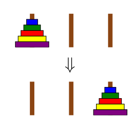
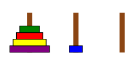
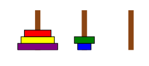

% Práctico Haskell 1

# Las Torres de Hanoi

Las Torres de Hanoi es un rompecabezas clásico con una solución que puede
ser expresada de manera recursiva. Se apilan discos de distintos tamaños
sobre tres palos. El objetivo es partir de una configuración inicial con
todos los discos apilados sobre el primer palo, a una configuración final
con todos los discos apilados en el último palo, tal como mostrado acá:

Las únicas reglas son:

* solo se puede mover un disco a la vez
* un disco más grande no puede ser apoyado sobre uno más chiquito.

Por ejemplo, como primer movimiento, podés mover el disco de arriba
(el más pequeño) a un palo distinto, dado que solo un disco puede ser
movido al mismo tiempo:

Desde ahi, es ilegal pasar a la configuración
mostrada como sigue:

Definí una función `hanoi` con el tipo siguiente:

~~~haskell
type Palo = String
type Movimiento = (Palo, Palo)
hanoi :: Integer -> Palo -> Palo -> Palo -> [Movimiento]
~~~

## Definiendo la función `hanoi`

Dada una cantidad de discos y nombres para los tres palos,
`hanoi` debe devolver una lista de movimientos a realizar para mover
la pila de discos del primer palo al segundo, usando el tercero
como espacio temporario.

¿Cuál debería ser la definición de `hanoi`? Considerá lo siguiente.
Para mover $n$ discos (apilados en tamaño creciente) desde el palo `a` al palo `b`,
usando el palo `c` como espacio temporario:

1. mové $n-1$ discos desde `a` a `c` usando `b` como espacio temporario
2. mové el disco de arriba de `a` a `b`
3. mové $n-1$ discos de `c` a `b` usando `a` como espacio temporario.

Estos tres pasos son suficientes para definir `hanoi`, y podés observar
que esa función es recursiva.

Observá que la declaración `type Palo = String` crea un sinónimo.
En este caso `Palo` es declarado como sinónimo de String, y los
nombres `Palo` y `String` pueden ser usados de manera indiferenciada.
Dar nombres más descriptivos a tipos de esa manera puede ser útil para
dar nombres más cortos a tipos complicados, o (como acá) simplemente
para ayudar con la documentación.

Por ejemplo: `hanoi 2 "a" "b" "c" == [("a","c"), ("a","b"), ("c","b")]`

