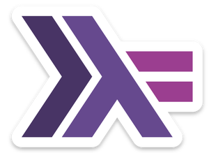

% Proyecto Final de Programación Declarativa

El examen final de Programación Declarativa es un examen escrito
que contiene una parte teórica y una parte práctica (programación).

Sin embargo, está la posibilidad de presentar un proyecto en Haskell
como examen final. Para hacerlo, es necesario seguir los pasos detallados
a continuación. Cualquier paso que no se cumpla para la fecha del
examen final hará inviable al proyecto y el/los alumno/s será/n
evaluado/s con el examen escrito.

* el proyecto se *debe* hacer usando la librería [brick](brick.html)

* tres semanas antes de la fecha del examen, mandar una propuesta
  de proyecto, de dos o tres párrafos a <guillaume.hoffmann@conicet.gov.ar>,
  conteniendo la propuesta de proyecto en texto bruto, y el o los
  participantes del proyecto (entre 1 o 3 estudiantes).
  Puede incluir unos links. Debe mencionar unos objetivos concretos,
  y mencionar qué librerías en Haskell se podrían utilizar, qué
  algoritmos se podrían implementar, etc.

* una vez que el profesor da su acuerdo con el proyecto, inicializar
  un repositorio darcs o git, y mandar su dirección al profesor. Se
  deberá utilizar el repositorio para el desarrollo del proyecto.
  Debe tener varios commits significantes (no uno solo que carga
  el proyecto terminado).
  
* si se llega a tres días antes de la fecha del final y el repositorio
  no tiene varios commits, o que los commits no demuestren la participación
  de todos los integrantes del proyecto, dicho proyecto se considerará
  como inviable para la fecha del examen, y el/los alumno/s harán el
  examen por escrito.

* requisitos del proyecto: andar con `ghc` version 8.6 o más reciente,
  tener un archivo de descripción `cabal` que contenga las dependencias
  del proyecto. Adenás, tener un archivo `README.md` con las instrucciones
  para usar el proyecto, los nombres de los autores y las fuentes
  de cualquier código que haya sido reutilizado.

# Checklist antes de la fecha del examen final

  * averiguar que compila con alguna versión de GHC 8.6 o mayor
  * pasar [HLint](https://hackage.haskell.org/package/hlint) sobre el código fuente
    y tomar en cuenta algunas sugerencias para mejorar el código
  * completar el archivo `README.md`
 
# Criterios de evaluación

|   Aspectos    |                 Criterios de evaluación                                |
|---------------|------------------------------------------------------------------------|
| Previo aviso  |  * Indispensable: mandar (una versión casi final de) el proyecto más   |
|               |    de 24 horas antes del final                                         |
|---------------|------------------------------------------------------------------------|
| Autoría       |  * Eliminatorio: plagio                                                |
|               |  * Bien: citar fuente código usado si hay                              |
|---------------|------------------------------------------------------------------------|
| Adecuación    |  * Bien: implementa la propuesta                                       |
|               |  * Mejor: agrega funciones                                             |
|---------------|------------------------------------------------------------------------|
| Esfuerzo      |  * Bien: parece un proyecto hecho en el tiempo pedido por el enunciado |
|---------------|------------------------------------------------------------------------|
| Correctitud   |  * Mal: No compila, tiene warnings, falla en la ejecución              |
|---------------|------------------------------------------------------------------------|
| Técnicas      |  * Bien: usa técnicas vistas en clases                                 |
|               |  * Mejor: usa técnicas encontradas fuera de clases                     |
|---------------|------------------------------------------------------------------------|
| Estética      |  * Bien: código indentado, uso de módulos, comentarios, HLint          |
|---------------|------------------------------------------------------------------------|
| Demostración  |  * Bien: preparar explicación del proyecto para el dia del examen      |
|               |  * Mal: leer el código en vivo sin explicar la intención de este       |

# Proyectos entregados desde 2015 (para no repetirlos)

| # alumnos  |               Descripción                                          | Nota  |
|------------|--------------------------------------------------------------------|-------|
|       2    | Generador de resumen de textos en HTML                             |   9   |
|       1    | Juego de truco en modo texto                                       |   6   |
|       1    | Intérprete de Chip8                                                |   10  |
|       1    | Mejoro de un programa de path tracing                              |   7   |
|       2    | Resolvedor de Sudoku                                               |   8   |
|       2    | 4 en linea                                                         |   7   |
|       1    | Motor de tilemap con QT                                            |   9   |
|       1    | Herramienta a lo `find` de Unix                                    |   7   |
|       1    | Protótipo de Arkanoid con Gloss                                    |   8   |
|       1    | Sokoban en modo texto                                              |   5   |
|       1    | Convertidor de Markdown a HTML usando combinadores de parsers      |   7   |
|       2    | Tateti con Gloss                                                   |   7   |

