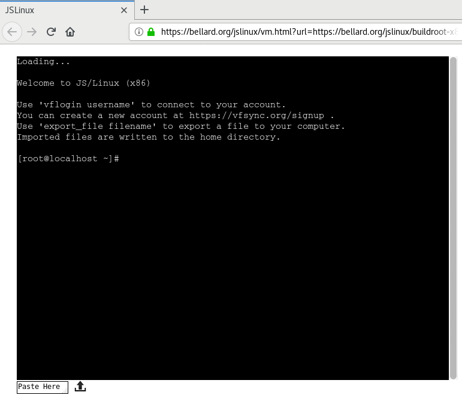

% Práctico 1: Linux en línea de comandos, programas simples en C

---

Desde un navegador web, entrá al [enlace siguiente](http://tinyurl.com/prog1linux)
y dejar que arranque el sistema. Despues de unos segundos, deberías ver algo así:

 

---

# Parte 1: Manejo de Linux en línea de comandos

## 1.1. Ejecutar comandos

{width=1cm} 1 o 2 participantes.

Ejecutar los comandos siguientes. Una vez que los probaron todos, volver a
ejecutarlos sin tipearlos de vuelta, solo usando las teclas Flecha-arriba
y Enter.

* `uptime` : indica desde hace cuanto tiempo el sistema se está ejecutando
* `pwd`: indica el camino de la carpeta actual
* `uname`: indica el nombre del sistema operativo
* `uname -a`: lo mismo pero con más detalles
* `ls`: lista los archivos de la carpeta actual
* `ls -l`: lo mismo con más datos sobre los archivos
* `cat hello.c`: muestra el contenido del archivo `hello.c`
* `ls dos`: lista los archivos contenidos en la carpeta `dos`

## 1.2. Navegar en el sistema de archivos

{width=1cm} 1 o 2 participantes.

Asegurarse que estamos en la carpeta por defecto despues de
arrancar el sistema JSLinux.

1. Listar los archivos de la carpeta actual.
2. Moverse a la carpeta `dos`, con el comando `cd dos`
3. Cual es el camino de la carpeta actual?
4. Listar los archivos de la (nueva) carpeta actual.

Estamos dentro de la carpeta `dos`. Seguimos.

1. Entrar a la carpeta `asm-1.9`.
2. Mostrar el camino de la carpeta actual.
3. Ejecutar el comando `cd ..` ; luego mostrar el camino de la carpeta actual.
4. De nuevo, ejecutar el comando `cd ..` ; luego mostrar el camino de la carpeta actual.

Seguimos, ahora creamos una carpeta nueva y aprendemos a saltar
más carpetas.

1. Ejecutar el comando `mkdir prog1`. Listar los archivos de la carpeta actual.
2. Entrar a la carpeta `dos`.
3. Entrar a la carpeta `asm-1.9`.
4. Ejecutar el comando `cd ../../prog1`. Mostrar el camino de la carpeta actual.

Aprendemos a crear archivos (sin nada adentro).

1. Ejecutar `touch leeme.txt`.
2. Listar los archivos de la carpeta actual.

Finalmente, resumamos.

1. Cuales son los comandos que  hemos usado en este ejercicio, y qué
   efecto tienen?

## 1.3. Ver y modificar el sistema de archivos

{width=1cm} 1 o 2 participantes.

Reiniciar el sistema JSLinux.

1. Listar los archivos en la carpeta actual.
2. Ejecutar `cat hello.c`.
3. Ejecutar `cp hello.c hola.c`.
4. Volver a listar los archivos.
5. Mostrar el contenido del archivo `hola.c`.

## 1.4. El comodín

{width=1cm} 1 o 2 participantes.

Reiniciar JSLinux.

1. Copiar `hello.c` a `hola.c`.
2. Crear una carpeta `prog1`.
3. Ejecutar `cp * prog1/`.
4. Entrar a la carpeta `prog1` y listar los archivos.

Vemos otro uso del comodín.

1. Volver a la carpeta madre.
3. Ejecutar `ls dos/h*`.
4. Ejecutar `cp dos/h* prog1/`.
5. Entrar a la carpeta `prog1` y listar los archivos.

## 1.5. Mover y renombrar archivos

{width=1cm} 1 o 2 participantes.

Reiniciar JSLinux.

1. Listar los archivos de la carpeta actual.
2. Ejecutar `mv hello.c hola.c`.
3. Listar los archivos de la carpeta actual.
4. Crear una carpeta `prog1`
5. Mover el archivo `hola.c` a la carpeta `prog1`.
6. Entrar a la carpeta `prog1`, listar los archivos.
7. Volver a la carpeta madre.
8. Ejecutar `mv prog1 programacion1`.
9. Listar los archivos.

## 1.6. Borrar archivos

{width=1cm} 1 o 2 participantes.

Reiniciar JSLinux.

1. Ejecutar el comando `mkdir prog1`.
2. Listar los archivos.
3. Ejecutar el comando `rm hello.c`.
4. Listar los archivos.
5. Ejecutar el comando `rm prog1`. ¿Qué ocurre?
6. Listar los archivos.
7. Ejecutar el comando `rm -r prog1`.
8. Listar los archivos.

## 1.7. Compilar un primer programa C

{width=1cm} 1 o 2 participantes.

Reiniciar JSLinux.

1. Listar los archivos en la carpeta actual.
2. Ejecutar el comando `tcc -run hello.c` (tiene cierta demora).
3. Listar los archivos en la carpeta actual.
4. Ejecutar el comando `tcc hello.c`.
5. Listar los archivos en la carpeta actual.
6. Ejecutar el comando `./a.out`.
7. Visualizar el contenido del archivo `hello.c` con `cat hello.c`.

# Parte 2: Programas secuenciales en C

Los ejercicios se deben hacer dentro de [JSLinux](http://tinyurl.com/prog1linux),
y con el editor de texto `vi`.

## 2.1. Programas simples con `putchar`

{width=1cm} 1 o 2 participantes.

 1. Crear un archivo nuevo `putchar.c` con el editor `vi`, y entrar el texto siguiente:

    ~~~C
    main(){
      putchar('h');
    }
    ~~~

 2. Guardarlo y salir de `vi`.

 3. Ejecutar el programa con `tcc -run putchar.c`.

 4. Reemplazar el carácter `h` entre los símbolos `'` `'` por otra letra del
    alfabeto, y volver a guardar, compilar y ejecutar el programa.

 5. Probar usando ahora alguno de estos carácteres: `'('  o ';'.

 6. Ahora probar usando el carácter `\n` (si bien *se escribe* con dos carácteres,
    es un solo carácter en el programa). ¿Qué hace ese carácter?

## 2.2. Programas con secuencias de `putchar`

{width=1cm} 1 o 2 participantes.

Reiniciar JSLinux.

 1. Crear un archivo nuevo `putchar.c` con el editor `vi`, y entrar el texto siguiente:

    ~~~C
    main(){
      putchar('h');
      putchar('o');
    }
    ~~~

 2. Guardarlo y salir de `vi`. Ejecutarlo.

 3. Después de la linea que se encarga de mostrar el carácter "o", agregar
    una linea que se encarga de mostrar un salto de linea. Ejecutar de vuelta el programa.

 4. Agregar las lineas necesarias para que su programa muestre el texto "Hola!", terminando
    con un salto de linea.

# Parte 3: trabajo a entregar

Mandar al profesor, por privado, una captura de pantalla de JSLinux mostrando la diferencia
de tamaño de los ejecutables generados por `tcc` y `gcc` a partir del archivo `hello.c` que
viene por defecto.

(Piensen en cómo hacer para tener estos dos ejecutables al mismo tiempo en la carpeta y cómo
imprimir sus tamaños.)
