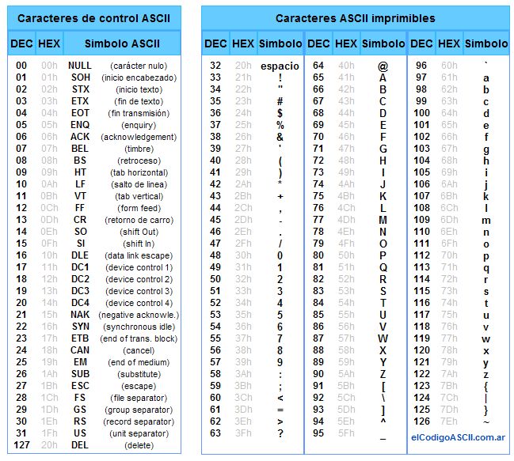

% Práctico 2: entrada y salida, variables

Los ejercicios se deben hacer dentro de [JSLinux](http://tinyurl.com/prog1linux),
y con el editor de texto `vi`.

# Parte 1: Código ASCII y `printf`

## 1.1. Programas con `printf`

{width=1cm} 1 o 2 participantes.

Reiniciar JSLinux.

 1. Crear un archivo nuevo `hola.c` con el editor `vi`, y entrar el texto siguiente:

    ~~~C
    main(){
      printf("Hola\n");
    }
    ~~~

 2. Guardarlo y salir de `vi`.

 3. Ejecutar el programa con `tcc -run hola.c`.

 4. Copiar `hola.c` al archivo nuevo `hola2.c`, 

 5. En `hola2.c`, sacar todos los espacios y saltos de línea:

    ~~~C
    main(){printf("Hola\n");}
    ~~~

    Ejecutar. ̉¿Hay alguna diferencia?

## 1.2. Secuencias de `printf` y `putchar`

 1. Pueden adivinar lo que muestra el programa siguiente?

    ~~~C
    main(){
      printf("Ho");
      printf("la");
      printf("!\n");
    }
    ~~~

    Probarlo en JSLinux.

 2. Pueden adivinar lo que muestra el programa siguiente?

    ~~~C
    main(){
      printf("Ho");
      /* printf("la"); */
      printf("!\n");
    }
    ~~~

    Probarlo en JSLinux.

 3. Pueden adivinar lo que muestra el programa siguiente?

    ~~~C
    main(){
      /* printf("Ho"); */
      printf("\nI");
      /* printf("la"); */
      printf("lum");
      /* printf("!\n"); */
      putchar('i');
      printf("na");
      /* printf("nio"); */
      putchar('t');
      putchar('i');
      printf("\n");
    }
    ~~~

    Probarlo en JSLinux con `tcc`.

## 1.3. Programas con `putchar` y código ASCII

{width=1cm} 1 o 2 participantes.

 1. Escribir un programa que use solamente la función `putchar` (varias veces)
    y solo con constantes numéricas, usando el código ASCII,
    con salida:

    ~~~
    Hola
    [salto de línea]
    ~~~

 2. Con la misma consigna, escribir otro programa cuya salida es:

    ~~~
    :)
    [salto de línea]
    ~~~

 3. Con la misma consigna, escribir otro programa cuya salida es:

    ~~~
    "Hola! \o/"
    [salto de línea]
    ~~~

## 1.4. Sustituciones en `printf`

{width=1cm} 1 o 2 participantes.

 1. En cada caso, ¿cuál es la cadena de carácteres impresa?

    a. `printf("bo%ca", 't');`
    b. `printf("pa%sta", "l");`
    c. `printf("%src%c", "cha", 'o');`
    d. `printf("c%cc%sr%cl%c", 'o', "od", 'i', 'o');`

 2. Escribir un programa que tenga la salida siguiente, con un solo
    uso de la función `printf` y usando sustitución de carácteres
    para mostrar las comillas
    (con el carácter de conversión `%c`):

    ~~~
    "Hola"[salto de línea]
    ~~~

# Parte 2: Entrada y salida

## 2.1. Asignaciones, expresiones aritmeticas y `printf`

¿Qué hace el programa siguiente? ¿Es lo que esperabas?
Probalo en JSLinux con `tcc` y corregí el error:

~~~C
main(){
  int a = 5;
  int b = 7;
  int c = a + b;
  a = b - c;
  b = a - c;
  c = a * b;
  printf("&d\n", c);
}
~~~

## 2.2. `scanf`

¿Qué hace el programa siguiente? ¿Es lo que esperabas?
Probalo en JSLinux con `tcc` y corregí los dos errores:

~~~C
main(){
  int a = 5;
  int b; 
  scanf("%d", b);
  a = a - b;
  printf("&d\n", a);
}
~~~

## 2.3. `scanf` y `printf`

{width=1cm} 1 o 2 participantes.

1. Escribir un programa C que haga lo siguiente

* pedir un entero al usuario
* luego imprimir un mensaje que diga "Usted ingreso el entero X.",
  donde X es reemplazado por el valor ingresado.
* luego imprimir "El valor absoluto del entero que ingreso es Y.",
  donde Y es reemplazado por el valor absoluto del valor ingresado.

Si `x` es alguna expresión aritmética, usar la función `abs(x)` para obtener su valor absoluto.

## 2.4. Problema

Tenemos que organizar un torneo de cartas. Según el reglamento del torneo, se deben ubicar
los jugadores en mesas de 3 o 4, con la condición de tener como máximo 3 mesas de 3 jugadores.

Escribir un programa que toma como entrada un valor entero (ese valor representa la cantidad
de jugadores que se inscriben al torneo), y luego imprime la cantidad de mesas necesarias.

El programa tiene que funcionar para 6 jugadores o más.

# Parte 3: Ejercicios no obligatorios

## 3.1. Programas que generan programas 

{width=1cm} 1 o 2 participantes.

 1. Usando las funciones `printf` y `putchar`, escribir
    un programa `padre.c` que **imprime** exactamente el programa siguiente:

    ~~~
    main(){
      printf("Hola!\n");
    }
    ~~~

    Hay varias formas de conseguir el mismo resultado.

 2. Comprobar que la salida generada es correcta de la manera siguiente:

    ~~~
    tcc -run padre.c > hijo.c
    tcc -run hijo.c
    ~~~

    El primer comando toma la salida de la ejecución de `padre.c` y la
    guarda en un archivo nuevo `hijo.c`.
    El segundo comando ejecuta el programa `hijo.c`.

## 3.2. Variables de tipo `char *`

{width=1cm} 1 o 2 participantes.

 1. Consideramos el programa siguiente:

    ~~~
    main(){
      printf("Hey!\n");
    }
    ~~~

    Modificarlo (pero manteniendo su salida) para que la línea del `printf`
    sea como sigue:

    ~~~
      printf(mensaje);
    ~~~

    Para eso, declarar una variable nueva de tipo `char *` y de nombre
    `mensaje`.

 2. Consideramos el programa `queen.c` siguiente:

    ~~~
    main(){
      printf("%s all,%s all, %s all,and %s now\n",
             "I want it", "I want it", "I want it", "I want it");
    }
    ~~~

    a. Modificar este programa de forma que la constante cadena de caracteres
      `"I want it"` aparezca una sola vez en el código. Para eso definir
      una variable nueva.
    b. Definir una segunda variable de tipo cadena de caracteres para que
       la llamada a la función `printf` no tenga ninguna constante cadena
       de caracteres.

## 3.3. Programa auto-replicante

{width=1cm} De 1 a 3 participantes.

1. Escribir un prograna cuya salida es su proprio código fuente.

