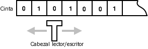

% Programación 1: Proyecto "Máquinas de Turing Cíclicas"

El objetivo es escribir un programa que simule Máquinas de Turing Binarias Cíclicas.

Una Máquina de Turing (MT) es un objeto matemático que fue inventado en los años 1930 por
Alan Turing. Cualquier software posible en este mundo tiene un equivalente como Máquina
de Turing, aunque una máquina de Turing tiene instrucciones tan sencillas que su tamaño
es casi siempre mayor al tamaño de un programa común (en C por ejemplo).

Una Máquina de Turing tiene:

* una *cinta de trabajo* donde lee y escribe sus cálculos
* un *cabezal* que indica qué parte de la cinta se está leyendo o escribiendo
* un *estado interno* que puede cambiar según como avaza la ejecución
* una *tabla de transición* (fija)

La tabla de transición define el comportamiento de la MT.
Para cada par *(estado activo,símbolo leído)*, indica:

* si se termina la ejecución de la máquina (instrucción FIN)
* sino:
    * un símbolo a escribir en la cinta
    * la dirección adonde el cabezal hará un paso (izquierda o derecha)
    * el nuevo estado interno

# Maquinas de Turing Binarias Cíclicas (MTBC)

Una MT binaria cíclica (MTBC) es una simplificación de la MT descrita en la sección
anterior. La diferencia es que su estado interno cambia cíclicamente: pasa de `a`
al `b`, luego `c`, y así. Cuando llega a su último estado, vuelve al estado `a` y sigue.

Entonces la tabla de transiciones de una MTBC es más simple que en una MT común.
Para cada par *(estado activo,símbolo leido)*, la tabla indica qué acción efectuar.
Las acciones son 5 posibles:

* finalizar la ejecución
* escribir 0 y mover el cabezal a la izquierda
* escribir 0 y mover el cabezal a la derecha
* escribir 1 y mover el cabezal a la izquierda
* escribir 1 y mover el cabezal a la derecha

Por ejemplo, esto es la tabla de transición de alguna MTBC:

~~~
  | 0| 1|
a |1>|1<|
b |1<|1>|
c | F|1>|
~~~

Tal tabla se puede representar por una cadena de caracteres.
Usamos la codificación siguiente: 

 instrucción                                           representación ascii
------------------------------------------------      ----------------------
finalizar la ejecución                                f
escribir 0 y mover el cabezal a la izquierda          o
escribir 0 y mover el cabezal a la derecha            O
escribir 1 y mover el cabezal a la izquierda          i
escribir 1 y mover el cabezal a la derecha            I

La tabla anterior tiene como representacion en cadena de caracteres: `IiiIfI`.

Y la siguiente:

~~~
  | 0| 1|
a |0>| F|
b |0<|1>|
c |1>|1<|
~~~

Tiene como representación: `OfoIIi`

# Objetivo del proyecto

Se trata de escribir un programa capaz de tomar la tabla de transición de una MTBC como
parámetro en línea de comando, ejecutarla cierta hasta llegar a que se detenga o
hasta que se hayan ejecutado cierta cantidad de pasos.

Debés implementar la simulación de MTBC a partir de una situación inicial "cinta a cero".
En cada paso se debe imprimir la cinta, y la instrucción que se está por ejecutar (mostrando
su código en la representación en cadena de caracteres).

El programa tiene que decir si la simulación se terminó sin que la máquina haya llegado
a una instruccion "fin". En el caso contrario, el programa indica cuántos pasos se ejecutó
la simulación.

La simulación siempre empieza con las condiciones siguientes:

* la cinta de trabajo está completamente inicializada a cero
* el estado interno de la máquina es `a` (el primero)

El límite de cantidad de pasos para la ejecución de la MTBC es indicado por una constante `T`
valiendo `50`. En consecuencia, podés declarar como cinta de trabajo un arreglo de tamaño `2*T+1`.
Si el cabezal de la máquina empieza en la posición `T` (al medio de la cinta),
no puede salir de esa cinta, pase lo que pase.

# Salidas a imitar

Unos ejemplos de como se puede ejecutar tu programa y qué salida tiene que tener:

~~~
$ ./a.out IiiofI
0000000000000000000000000000000000000000000000000000000000000000000000000000000000000000000000000000 instruccion I
0000000000000000000000000000000000000000000000000010000000000000000000000000000000000000000000000000 instruccion i
0000000000000000000000000000000000000000000000000011000000000000000000000000000000000000000000000000 instruccion I
0000000000000000000000000000000000000000000000000011000000000000000000000000000000000000000000000000 instruccion i
0000000000000000000000000000000000000000000000000011000000000000000000000000000000000000000000000000 instruccion o
0000000000000000000000000000000000000000000000000001000000000000000000000000000000000000000000000000 instruccion f
fin de ejecucion en 6 pasos
~~~

~~~
$ ./a.out IiioIf
0000000000000000000000000000000000000000000000000000000000000000000000000000000000000000000000000000 instruccion I
0000000000000000000000000000000000000000000000000010000000000000000000000000000000000000000000000000 instruccion i
0000000000000000000000000000000000000000000000000011000000000000000000000000000000000000000000000000 instruccion f
fin de ejecucion en 3 pasos
~~~

~~~
$ ./a.out IiioIi
0000000000000000000000000000000000000000000000000000000000000000000000000000000000000000000000000000 instruccion I
0000000000000000000000000000000000000000000000000010000000000000000000000000000000000000000000000000 instruccion i
0000000000000000000000000000000000000000000000000011000000000000000000000000000000000000000000000000 instruccion i
0000000000000000000000000000000000000000000000000011000000000000000000000000000000000000000000000000 instruccion I
0000000000000000000000000000000000000000000000000111000000000000000000000000000000000000000000000000 instruccion o
0000000000000000000000000000000000000000000000000101000000000000000000000000000000000000000000000000 instruccion i
0000000000000000000000000000000000000000000000000101000000000000000000000000000000000000000000000000 instruccion I
0000000000000000000000000000000000000000000000001101000000000000000000000000000000000000000000000000 instruccion o
0000000000000000000000000000000000000000000000001001000000000000000000000000000000000000000000000000 instruccion i
0000000000000000000000000000000000000000000000001001000000000000000000000000000000000000000000000000 instruccion I
0000000000000000000000000000000000000000000000011001000000000000000000000000000000000000000000000000 instruccion o
0000000000000000000000000000000000000000000000010001000000000000000000000000000000000000000000000000 instruccion i
0000000000000000000000000000000000000000000000010001000000000000000000000000000000000000000000000000 instruccion I
0000000000000000000000000000000000000000000000110001000000000000000000000000000000000000000000000000 instruccion o
0000000000000000000000000000000000000000000000100001000000000000000000000000000000000000000000000000 instruccion i
0000000000000000000000000000000000000000000000100001000000000000000000000000000000000000000000000000 instruccion I
0000000000000000000000000000000000000000000001100001000000000000000000000000000000000000000000000000 instruccion o
0000000000000000000000000000000000000000000001000001000000000000000000000000000000000000000000000000 instruccion i
0000000000000000000000000000000000000000000001000001000000000000000000000000000000000000000000000000 instruccion I
0000000000000000000000000000000000000000000011000001000000000000000000000000000000000000000000000000 instruccion o
0000000000000000000000000000000000000000000010000001000000000000000000000000000000000000000000000000 instruccion i
0000000000000000000000000000000000000000000010000001000000000000000000000000000000000000000000000000 instruccion I
0000000000000000000000000000000000000000000110000001000000000000000000000000000000000000000000000000 instruccion o
0000000000000000000000000000000000000000000100000001000000000000000000000000000000000000000000000000 instruccion i
0000000000000000000000000000000000000000000100000001000000000000000000000000000000000000000000000000 instruccion I
0000000000000000000000000000000000000000001100000001000000000000000000000000000000000000000000000000 instruccion o
0000000000000000000000000000000000000000001000000001000000000000000000000000000000000000000000000000 instruccion i
0000000000000000000000000000000000000000001000000001000000000000000000000000000000000000000000000000 instruccion I
0000000000000000000000000000000000000000011000000001000000000000000000000000000000000000000000000000 instruccion o
0000000000000000000000000000000000000000010000000001000000000000000000000000000000000000000000000000 instruccion i
0000000000000000000000000000000000000000010000000001000000000000000000000000000000000000000000000000 instruccion I
0000000000000000000000000000000000000000110000000001000000000000000000000000000000000000000000000000 instruccion o
0000000000000000000000000000000000000000100000000001000000000000000000000000000000000000000000000000 instruccion i
0000000000000000000000000000000000000000100000000001000000000000000000000000000000000000000000000000 instruccion I
0000000000000000000000000000000000000001100000000001000000000000000000000000000000000000000000000000 instruccion o
0000000000000000000000000000000000000001000000000001000000000000000000000000000000000000000000000000 instruccion i
0000000000000000000000000000000000000001000000000001000000000000000000000000000000000000000000000000 instruccion I
0000000000000000000000000000000000000011000000000001000000000000000000000000000000000000000000000000 instruccion o
0000000000000000000000000000000000000010000000000001000000000000000000000000000000000000000000000000 instruccion i
0000000000000000000000000000000000000010000000000001000000000000000000000000000000000000000000000000 instruccion I
0000000000000000000000000000000000000110000000000001000000000000000000000000000000000000000000000000 instruccion o
0000000000000000000000000000000000000100000000000001000000000000000000000000000000000000000000000000 instruccion i
0000000000000000000000000000000000000100000000000001000000000000000000000000000000000000000000000000 instruccion I
0000000000000000000000000000000000001100000000000001000000000000000000000000000000000000000000000000 instruccion o
0000000000000000000000000000000000001000000000000001000000000000000000000000000000000000000000000000 instruccion i
0000000000000000000000000000000000001000000000000001000000000000000000000000000000000000000000000000 instruccion I
0000000000000000000000000000000000011000000000000001000000000000000000000000000000000000000000000000 instruccion o
0000000000000000000000000000000000010000000000000001000000000000000000000000000000000000000000000000 instruccion i
0000000000000000000000000000000000010000000000000001000000000000000000000000000000000000000000000000 instruccion I
0000000000000000000000000000000000110000000000000001000000000000000000000000000000000000000000000000 instruccion o
fin de ejecucion por limite de tiempo (50 pasos)
~~~

# Ejemplos para verificar la implementación

Podés usar los ejemplos siguientes para controlar que tu programa no tiene errores.

~~~
Iiif         6 pasos
Iiof         supera el limite de 50 pasos
IiioIf       3 pasos
IiiofI       6 pasos
IiioooIf     8 pasos
IiiooiIf    12 pasos
~~~

# Competencia MTBC más aguantadora

Como "bonus" de este proyecto, va una pequeña competencia.

Consideremos todas las MTBC con `n` estados, y de todas esas,
consideremos solo las cuya ejecución es finita.
Cuál es el record de pasos que puede hacer una MTBC de `n` estados,
antes de detenerse?

Con tu programa, entregá candidatos para la categorias 3, 4, 5, 6 y 7 estados.

El 10/6 haremos una evaluación de las MTBC más aguantadoras (¡el profesor
también participa a la competencia!).

# Criterios de evaluación y de regularidad

{width=1cm}
A hacer en grupo de 2 o 3.

La entrega final del proyecto es lunes 10/6 antes de las 17hs.

Mandar el código C a <guillaumh@gmail.com>.

Indicar los nombres de los integrantes del grupo en el codigo fuente, y llamar el archivo
con los apellidos de los integrantes.

Se tomará en cuenta (en el orden siguiente de prioridad):

* que el código sea autoría de quienes lo entreguen
* que compile con `tcc` y `gcc -Wall` sin warnings
* que sea mantenible, es decir, si se cambian los requisitos del enunciado,
  sea fácil de modificar
* que sea el más corto posible (en cantidad de sentencias y de variables usadas)
* que esté bien presentado (con indentación, elegir bien los nombres de variables)
* la evaluación para grupos de 3 será más estricta

Este proyecto cuenta como 4 puntos sobre los 10 puntos del parcial 2.
Sin embargo si recibe una puntuación de 0, el parcial será directamente desaprobado.
