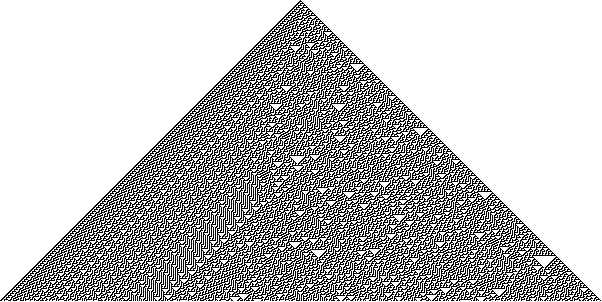

% Programación 1: Proyecto Arreglos

A hacer individualmente o por grupo de 2.

Mandar su código C a <guillaumh@gmail.com>, hasta el lunes 11/6 a las 7hs59 de la mañana.
Indicar los nombres de los integrantes del grupo en el codigo fuente.

Hacer este ejercicio dentro de [JSLinux](http://tinyurl.com/prog1linux),
y con el editor de texto `vi`.

El programa tiene que compilar sin warning con `gcc` y ejecutarse correctamente con `tcc`.

# Autómata celular unidimensional

Este proyecto consiste en reimplementar [el programa `rule30`](rule30) que vamos a describir a continuación.

Un Automata Celular Unidimensional (ACU) consiste en un
arreglo de una dimensión, cuyos elementos (llamados células)
pueden estar en dos estados posibles (0 o 1).

El estado de un ACU evoluciona en el tiempo.
Esta evolución se hace en tiempo discreto y sincronizado, es decir,
en cada paso, todas las células cambian de estado al mismo tiempo.

En un momento $t$, el estado de las células determina completamente
el estado de las células en el momento $t+1$. Más precisamente,
para saber el estado de una célula en posición $i$ del arreglo
en un momento $t+1$, solo se necesita mirar los estados de 3 células
en el momento $t$: las que están en posición $i-1$, $i$ e $i+1$.

En este marco, el estado de una célula depende solo del estado de sus
vecinas inmediatas y del suyo en el paso anterior.
Hay $2^3=8$ patrones de 3 células binarias.
Para cada patrón, está definido el estado nuevo de la
célula afectada en el paso siguiente:

------------  --- --- --- --- --- --- --- ---
Patrón        111 110 101 100 011 010 001 000
Estado nuevo   ?   ?   ?   ?   ?   ?   ?   ?
------------  --- --- --- --- --- --- --- ---

Para definir el comportamiento de un ACU, 
tenemos que definir la función que nos da esta transición.
Es decir, tenemos que fijar los 8 bits faltantes de la tabla (representados por el símbolo `?`).
Por lo cual, tenemos $2^8 = 256$ reglas distintas de ACU.

En este proyecto vamos a implementar el ACU llamado "Regla 30".

## El nombre de las reglas

Los ACU tienen como nombre la palabra "Regla" seguida
de la representación decimal del byte de la segunda línea
de la tabla vista más arriba. Es decir, el nombre de un ACU
define completamente su comportamiento.

Por ejemplo, el automata definido por:
 
------------  --- --- --- --- --- --- --- ---
Patrón        111 110 101 100 011 010 001 000
Estado nuevo   0   0   0   0   0   0   0   0
------------  --- --- --- --- --- --- --- ---

se llama "Regla 0", dado que $0_d = 0000000_b$.

El siguiente:

------------  --- --- --- --- --- --- --- ---
Patrón        111 110 101 100 011 010 001 000
Estado nuevo   0   0   0   0   0   0   0   1
------------  --- --- --- --- --- --- --- ---

se llama "Regla 1", dado que $1_d = 0000001_b$.

El siguiente:

------------  --- --- --- --- --- --- --- ---
Patrón        111 110 101 100 011 010 001 000
Estado nuevo   1   1   1   1   1   1   1   1
------------  --- --- --- --- --- --- --- ---

es "Regla 255", dado que $255_d = 11111111_b$.

El automata que nos interesa en este proyecto es
Regla 30:

------------  --- --- --- --- --- --- --- ---
Patrón        111 110 101 100 011 010 001 000
Estado nuevo   0   0   0   1   1   1   1   0
------------  --- --- --- --- --- --- --- ---

Todos los ACU son totalmente deterministas.
Varios de ellos tienen una ejecución simple y predecible.
Sin embargo, algunos tienen un comportamiento
aparentemente caótico y muy sensible al estado inicial,
y Regla 30 es uno de ellos.

Cuando el autómata Regla 30 empieza con una
sola célula en estado 1 y el resto a 0, 
el principio de su *grafo temporal* (es decir la representación
gráfica de sus estados línea por línea, desde el tiempo $t=0$)
es el siguiente:

## Programa de ejemplo

En [JSLinux](http://tinyurl.com/prog1linux), cargar [el ejecutable `rule30`](rule30)
usando el icono de subida de archivos abajo de la pantalla simulada.

Luego, ejecutar el comando siguiente para permitir su ejecución:

~~~C
chmod +x rule30
~~~

Y luego ejecutarlo con:

~~~C
./rule30
~~~

La ejecución del programa es infinita, pero se puede interrumpir con `CTRL+c`.

El objetivo de este proyecto es implementar un programa
que muestre el grafo del automata Regla 30, tal como
lo hace el programa `rule30`.

## Implementación

### El arreglo

Si bien el modelo matemático de un ACU es definido
sobre un arreglo infinito en las dos direcciones,
solo podemos representar una cantidad finita de células
en un programa C. En consecuencia, nuestro programa va
a usar un arreglo de tamaño finito, y vamos a considerar
que la primera y la última células son adyacentes.
Es decir, en nuestra implementación el ACU va a ser un toro (o cinta circular).

Más concretamente, en el arreglo `c` de tamaño T,
el elemento `c[0]` tiene como vecinos los elementos
`c[T-1]` y `c[1]`. Por otro lado el elemento `c[T-1]`
tiene como vecinos los elementos `c[T-2]` y `c[0]`.

A tomar en cuenta para mostrar el grafo temporal del
automata Regla 30, la interfaz en línea de comando
de `JSLinux` tiene 80 caracteres de ancho. Entonces es
necesario fijar un tamaño de arreglo `T` menor a 80.

### El estado inicial

En el tiempo $t=0$ el arreglo es inicialmente puesto
a cero, salvo por el elemento en posición `T/2` puesto
a 1.

### Mostrar el automata

Esta parte es la más fácil. Basta recorrer el arreglo;
si una célula está en el estado 0, imprimir un carácter
espacio, en el caso contrario imprimir un carácter que
sea "denso en píxeles" y de forma regular, tal que
`X`, `*`, `#`, etc.

### Transición

Esta parte es la más difícil :-) Es necesario usar un segundo
arreglo para construir el estado al tiempo $t+1$. Recién cuando
se ha construido el estado al tiempo $t+1$ se puede copiar todo
su contenido al arreglo anterior, y seguir repitiendo. Hay varias
formas de implementar la transición del autómata, las más sencillas
de encontrar son también las más largas de escribir. Por lo cual
el desafío acá es hacerlo de manera concisa.

### Bucle infinito

Todo esto se tiene que repetir una cantidad infinita de veces.
Es decir, hay que incluir todo esto dentro de un bucle principal
cuya condición
sea siempre verdadera.

### Introducir demoras

Para hacer más lenta y agradable la impresión del autómata,
introducí una pequeña demora en el bucle principal de tu
programa. Para hacer eso usa la función `usleep` como sigue:

~~~C
usleep(100000);
~~~ 

## Criterios de evaluación y de regularidad

Se tomará en cuenta (en el orden siguiente de prioridad):

* Que el código sea autoría de quienes lo entreguen
* Que compile con `tcc` y `gcc`
* Que no emite warnings con `gcc` ni `tcc`
* Que haga lo que pide el enunciado
* Que esté bien presentado (con indentación)
* Que sea el más corto posible (en cantidad de líneas de código y de variables usadas)

Este proyecto cuenta como 4 puntos sobre los 10 puntos del parcial 3.
Sin embargo si no es entregado, o si es entregado y recibe una puntuación de cero,
el parcial 3 será directamente no aprobado.

